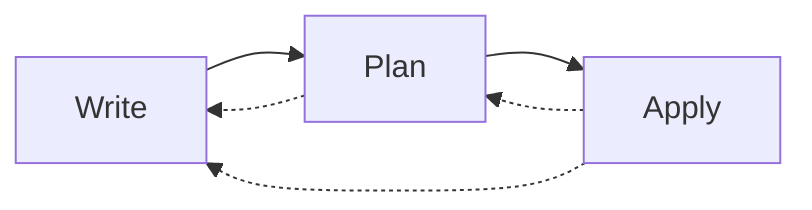

# The Core Terraform Workflow

The core Terraform workflow has three steps:

1. Write - Create Terraform configuration.
1. Plan - Preview changes before applying.
1. Apply - Provision infrastructure.

## Outline

- [Configuration Syntax](configuration-syntax)
- [Provisioning Infrastructure](provisioning-infrastructure)
- [Providers and Resources](providers-and-resources)
- [Destroying Infrastructure](destroying-infrastructure)
