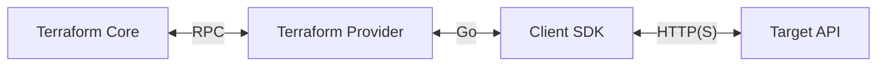

# Providers and Resources

## Providers

Providers are plugins that Terraform uses to communicate with upstream APIs.



### Finding Providers

You can search for providers on the
[Terraform Registry](https://registry.terraform.io/).

### Requiring Providers

Once you've found a provider, you'll have to require it in your Terraform
configuration in order to use it.

```hcl
terraform {
  required_providers {
    aws = {
      source  = "hashicorp/aws"
      version = "~> 4.0"
    }
  }
}
```

### Configuring Providers

Most providers need to be configured before they can be used. Configuration
usually involves passing in credentials that are used to communicate with
upstream APIs but may include other configuration such as the region you wish
to use.

Providers are configured using a `provider` block.

```hcl
# AWS credentials are read from the AWS CLI or environment variables.
provider "aws" {
  region = "us-east-1"
}
```

### Aliasing Providers

To define multiple configurations for the same provider, create a provider
alias. This is useful when you want to use the same provider in slightly
different ways, such as supporting multiple regions.

```hcl
provider "aws" {
  region = "us-east-1"
}

provider "aws" {
  alias  = "secondary"
  region = "us-west-1"
}
```

## Resources

Resources are the objects that Terraform should create, read, update, or
delete. Examples of resources include AWS EC2 instances, Azure virtual
networks, GitHub repositories, PagerDuty schedules, etc.

Providers offer different resources for use.

### Defining Resources

Resources are defined inside `resource` blocks.

```hcl
resource "aws_instance" "app" {
  ami           = "ami-052efd3df9dad4825"
  instance_type = "t3.micro"

  tags = {
    Name = "app"
    Environment = "Development"
  }
}
```

The resource block expects two labels; the resource type (`aws_instance`) and
the resource name (`app`).

Together, the resource type and resource name serve as a unique identifier for
a resource.

### Resource Types

Resource types follow the syntax `PROVIDER_RESOURCE`.

The `aws_instance` resource type refers to the `instance` resource within the
`aws` provider. Similarly, the `azurerm_linux_virtual_machine` resource type
refers to the `linux_virtual_machine` resource within the `azurerm` provider.

### Attributes vs. Arguments

Every resource has attributes associated with it that differ depending on the
resource type.

Attributes that you can set are called arguments. Attributes that you cannot
set are called read-only attributes. The documentation for a resource details
which attributes are arguments and which attributes are read-only attributes.

Some attributes will not be known until after a resource is created. For
example, an instance's ID.

We'll use the term attributes to refer to both read-only attributes and
arguments and only make a distinction when necessary.

### Meta-Arguments

All resources support the following meta-arguments that can be used to
change their behavior:

- `depends_on` - Explicitly define dependencies.
- `count` - Create multiple resources using indices.
- `for_each` - Create multiple named resources using keys.
- `provider` - Select a specific provider to use for the resource.
- `lifecycle` - Customize the resource lifecycle.
- `provisioner` - Provision a given resource after creation or destruction.
