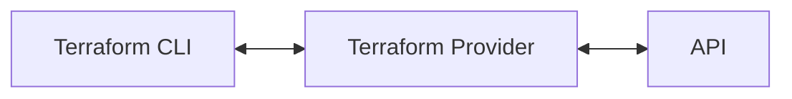

# Getting Started

In this section, you will learn how to do the following:

- Describe what Terraform is and how it works.
- Understand why you'd want to use Terraform.
- Install Terraform on your system.
- Configure your editor for use with Terraform.
- Create an AWS account.
- Generate AWS API credentials.

## What is Terraform?

Terraform is a tool that lets you define API resources as code and perform
create, read, update, and delete (CRUD) operations against those resources. Put
another way, Terraform is a stateful, declarative wrapper around CRUD APIs.

Terraform is often referred to as an "infrastructure as code" tool. While that
is true, Terraform is not limited to managing just infrastructure. It can manage
any resource that is fronted by a CRUD API, including AWS, Azure, GCP resources,
Kubernetes deployments, GitHub repositories, etc.

## How does Terraform work?

Terraform communicates with upstream APIs using a special type of plugin known
as a provider. Providers allow Terraform to create, read, update, or delete
infrastructure.



There are many providers written for Terraform. You can search for providers on
the [Terraform Registry](https://registry.terraform.io/).

Once you've found a provider, you're ready to create your first Terraform
configuration.

## Why use Terraform?

If you've ever manually created resources by clicking around in a user
interface, you'll know that the process is time consuming and error prone.
Terraform provides the following benefits to address these concerns.

- **Declarative** - You describe the end state of your infrastructure and
  Terraform works to make that a reality. You no longer need to write complex
  step-by-step operations to ensure your infrastructure is correctly
  provisioned. Terraform builds a resource graph to determine resource
  dependencies and creates or modifies non-dependent resources in parallel,
  saving you time.

- **Idempotent** - Terraform detects when infrastructure needs modification and
  will only modify infrastructure that needs modification. Assuming
  infrastructure isn't modified outside of Terraform, a Terraform configuration
  can be applied multiple times without modifying the infrastructure.

- **Reusable** - Terraform configuration is stored as files that can be
  committed to your version control system (VCS). This allows you to write
  configuration that can be consumed across teams, ensuring that each team is
  deploying consistent infrastructure in line with your organization's
  policies.

- **Trackable** - Terraform generates a plan of what operations it wants to
  perform before modifying your infrastructure. Once a plan is approved and
  applied, Terraform keeps track of the infrastructure it manages in a state
  file. Combined with version control, you'll never wonder who or what created
  infrastructure again.

- **Agnostic** - Terraform utilizes its own configuration language to provide
  the same experience across infrastructure providers. You use the same
  configuration language to manage infrastructure AWS, GCP, and Azure
  infrastructure.

## Terraform Installation

This course requires Terraform 1.3 or later.

Download and install
[Terraform](https://developer.hashicorp.com/terraform/downloads).

To validate your Terraform installation, open a terminal and run `terraform
version`.

```
> terraform version
Terraform v1.4.5
on linux_amd64
```

### Install Go

Terraform and its providers are written in Go. To compile Terraform and its
providers, download and install [Go](https://go.dev/doc/install).

To validate your Go installation, open a terminal and run `go version`.

```
> go version
go version go1.20.3 linux/amd64
```

### (Optional) Install Graphviz

Terraform can generate a graph of its configuration. If you'd like to visualize
this graph, install [Graphviz](https://graphviz.org/).

## Editor Configuration

You'll spend a lot of time in your code editor writing Terraform configuration.
Proper editor configuration will give you features such as syntax highlighting,
code formatting, and more.

### Visual Studio Code (VS Code)

Install the
[Terraform extension](https://marketplace.visualstudio.com/items?itemName=HashiCorp.terraform)
for VS Code.

### Vim / Neovim

Install the
[Terraform Language Server](https://github.com/hashicorp/terraform-ls)
and
[configure your Language Server Protocol (LSP) client](https://github.com/hashicorp/terraform-ls/blob/main/docs/USAGE.md)
to use it.

## Cloud Provider Configuration

This course uses Terraform to manage AWS infrastructure. You'll need access to
an AWS account to follow along.

### Create an AWS Account

Create an [AWS account](https://aws.amazon.com/free) if you don't already have
one.

> **Warning**
> You are responsible for any charges that you may incur.

### Install the AWS CLI

We'll use the AWS CLI to securely store our AWS API credentials and query the
AWS API directly.

Download and install the [AWS CLI](https://aws.amazon.com/cli/).

To validate your AWS CLI installation, open a terminal and run `aws --version`.

```
> aws --version
aws-cli/2.11.13 Python/3.11.3 Linux/6.2.10-200.fc37.x86_64 exe/x86_64.fedora.37 prompt/off
```

### Generating API Credentials

Terraform will use AWS API credentials to authenticate to AWS.

To generate AWS API credentials:

1. Navigate to the
  [IAM service](https://console.aws.amazon.com/iamv2/home) in the AWS console.
1. Create a new IAM user.
1. Generate API credentials for this IAM user.
1. Configure the AWS CLI to use these API credentials.

    ```
    > aws configure
    AWS Access Key ID [None]: AKIA****************
    AWS Secret Access Key [None]: 5g40************************************
    Default region name [None]: us-east-1
    Default output format [None]:
    ```

1. Confirm you can communicate with AWS.

    ```
    > aws sts get-caller-identity
    {
        "UserId": "AIDA*****************",
        "Account": "371868434650",
        "Arn": "arn:aws:iam::371868434650:user/sudomateo"
    }
    ```
