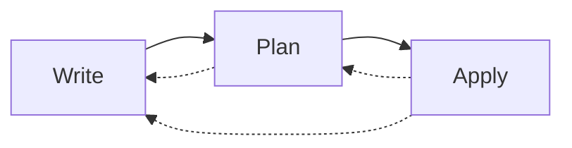
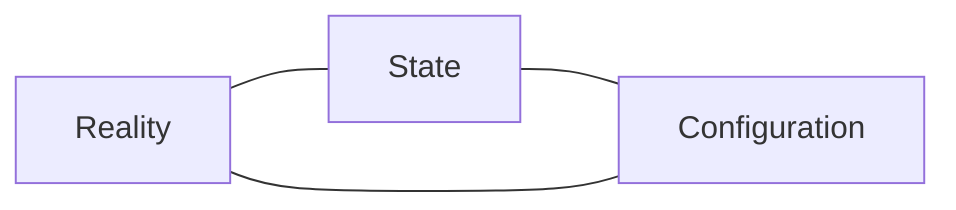

# Terraform Basics

In this section, you will learn how to do the following:

- Read Terraform configuration written in HCL and JSON.
- Describe the core Terraform workflow.
- Provision, modify, and destroy infrastructure using the core Terraform workflow.
- Describe the purpose of Terraform state.

## Configuration Syntax

Terraform configuration is written in either
[HashiCorp Configuration Language (HCL)](https://github.com/hashicorp/hcl)
or JSON syntax.

### HCL

HCL is the native syntax for Terraform configuration that provides a good
balance between readability and maintainability. HCL configuration is stored in
files with the `.tf` file extension.

For a more detailed description of HCL, check out the
[HCL Native Syntax Specification](https://github.com/hashicorp/hcl/blob/main/hclsyntax/spec.md).

HCL is built around two concepts; attributes and blocks.

#### Attributes

An attribute assigns the value of an `EXPRESSION` to a particular `IDENTIFIER`:

```hcl
IDENTIFER = EXPRESSION
```

An `IDENTIFIER` can contain letters (`a-z`, `A-Z`), digits (`0-9`), underscores
(`_`), and hyphens (`-`). However, the first character of an `IDENTIFIER` must
not be a digit.

An `EXPRESSION` represents an attribute's value. This can either be a literal
value or a programmatically generated value.

Example attribute:

```hcl
ami = "ami-007855ac798b5175e"
```

#### Blocks

A block is a container used to hold attributes and other blocks.

```hcl
TYPE "LABEL" "LABEL" {
  IDENTIFIER = EXPRESSION

  TYPE {
    IDENTIFIER = EXPRESSION
  }
}
```

A `TYPE` represents the block type. Block types tell Terraform what schema is
valid for the block.

Blocks can have zero or more `LABEL`s depending on the `TYPE`.

Example block:

```hcl
resource "aws_instance" "app" {
  ami           = "ami-007855ac798b5175e"
  instance_type = "t3.micro"

  metadata_options {
    http_endpoint = "enabled"
  }
}
```

#### HCL Comments

HCL supports comments:

```hcl
/*
This is a multi-line comment.
Multi-line comments are not idiomatic.
Use multiple single-line comments instead.
*/
resource "aws_instance" "app" {
  # This is a single-line comment using the idiomatic `#` syntax.
  ami           = "ami-007855ac798b5175e"
  instance_type = "t3.micro"

  // This is a single-line comment using the non-idiomatic `//` syntax.
  metadata_options {
    http_endpoint = "enabled"
  }
}
```

### JSON

JSON is an alternative syntax for Terraform configuration that is useful when
programmatically reading and writing Terraform configuration. JSON
configuration is stored in files with the `.tf.json` file extension.

Here's what the above HCL Terraform configuration looks like in JSON.

```json
{
  "resource": [
    {
      "aws_instance": [
        {
          "app": [
            {
              "ami": "ami-007855ac798b5175e",
              "instance_type": "t3.micro",
              "metadata_options": [
                {
                  "http_endpoint": "enabled"
                }
              ]
            }
          ]
        }
      ]
    }
  ]
}
```

#### JSON Comments

JSON syntax supports a limited form of comments by using a `//` attribute.

```json
{
  "//": "This is a comment.",
  "resource": [
    {
      "aws_instance": [
        {
          "app": [
            {
              "ami": "ami-007855ac798b5175e",
              "instance_type": "t3.micro",
              "metadata_options": [
                {
                  "http_endpoint": "enabled"
                }
              ]
            }
          ]
        }
      ]
    }
  ]
}
```

## The Core Workflow

The core workflow has three steps:

1. **Write** - Author infrastructure as code.
1. **Plan** - Preview changes before applying.
1. **Apply** - Provision reproducible infrastructure.



### Write

Write Terraform configuration in a file named `main.tf` to define your
infrastructure as code.

```hcl
terraform {
  required_providers {
    aws = {
      source  = "hashicorp/aws"
      version = "~> 4.0"
    }
  }
}

provider "aws" {}

resource "aws_instance" "app" {
  ami           = "ami-007855ac798b5175e"
  instance_type = "t3.micro"
}
```

#### Initializing Configuration

Your configuration must be initialized before Terraform can provision
infrastructure.

The initialization process:

- Configures the state backend.
- Downloads provider plugins.
- Downloads modules.

```
> terraform init

Initializing the backend...

Initializing provider plugins...
- Finding hashicorp/aws versions matching "~> 4.0"...
- Installing hashicorp/aws v4.55.0...
- Installed hashicorp/aws v4.55.0 (signed by HashiCorp)

Terraform has been successfully initialized!
```

### Plan

Once your configuration is written and initialized, generate an execution plan
to preview the changes that Terraform plans to make to your infrastructure.

```
> terraform plan
Terraform used the selected providers to generate the following execution plan. Resource actions are
indicated with the following symbols:
  + create

Terraform will perform the following actions:

  # aws_instance.app will be created
  + resource "aws_instance" "app" {
      + ami                                  = "ami-007855ac798b5175e"
      + id                                   = (known after apply)
      + instance_type                        = "t3.micro"
      ...
    }

Plan: 1 to add, 0 to change, 0 to destroy.
```

If you are not satisfied with the proposed changes, go back and update your
configuration and generate a new execution plan.

### Apply

Once you're satisfied with the execution plan, tell Terraform to provision your
infrastructure.

```
> terraform apply
Terraform used the selected providers to generate the following execution plan. Resource actions are
indicated with the following symbols:
  + create

Terraform will perform the following actions:

  # aws_instance.app will be created
  + resource "aws_instance" "app" {
      + ami                                  = "ami-007855ac798b5175e"
      + id                                   = (known after apply)
      + instance_type                        = "t3.micro"
      ...
    }

Plan: 1 to add, 0 to change, 0 to destroy.
```

Terraform will prompt for confirmation before provisioning your infrastructure.

```
> terraform apply
...
Do you want to perform these actions?
  Terraform will perform the actions described above.
  Only 'yes' will be accepted to approve.

  Enter a value: yes

aws_instance.app: Creating...
aws_instance.app: Still creating... [10s elapsed]
aws_instance.app: Creation complete after 13s [id=i-0175015733497c376]

Apply complete! Resources: 1 added, 0 changed, 0 destroyed.
```

## Modifying Infrastructure

Spinning up an instance is great, but we still don't have a way to connect to
it and use it. Let's add an SSH key and update the security group rules so that
we can connect to the instance.

### Adding an SSH Key

Generate an SSH key if you don't already have one.

```
ssh-keygen -t ed25519
```

Update your `main.tf` to create an `aws_key_pair` resource using your
public SSH key.

```hcl
resource "aws_instance" "app" {
  ami           = "ami-007855ac798b5175e"
  instance_type = "t3.micro"
  key_name      = aws_key_pair.app.key_name
}

resource "aws_key_pair" "app" {
  key_name   = "app"
  public_key = "ssh-ed25519 AAAAC3NzaC1lZDI1NTE5AAAAIETEma9o59PQm3venxMkocCM8mifE0hspFm5XsYeccw8"
}
```

Generate an execution plan to see that Terraform must replace your instance in
order to add an SSH key pair to it.

```
> terraform plan
aws_instance.app: Refreshing state... [id=i-0175015733497c376]

Terraform used the selected providers to generate the following execution plan. Resource actions are
indicated with the following symbols:
  + create
-/+ destroy and then create replacement

Terraform will perform the following actions:

  # aws_instance.app must be replaced
-/+ resource "aws_instance" "app" {
      ~ id                                   = "i-0175015733497c376" -> (known after apply)
      + key_name                             = "app" # forces replacement
      ...
    }

  # aws_key_pair.app will be created
  + resource "aws_key_pair" "app" {
      + arn             = (known after apply)
      + fingerprint     = (known after apply)
      + id              = (known after apply)
      + key_name        = "app"
      + key_name_prefix = (known after apply)
      + key_pair_id     = (known after apply)
      + key_type        = (known after apply)
      + public_key      = "ssh-ed25519 AAAAC3NzaC1lZDI1NTE5AAAAIETEma9o59PQm3venxMkocCM8mifE0hspFm5XsYeccw8"
      + tags_all        = (known after apply)
    }

Plan: 2 to add, 0 to change, 1 to destroy.
```

Apply your configuration to destroy your existing instance and create a new one
with your SSH key pair attached.

```
> terraform apply
...
Do you want to perform these actions?
  Terraform will perform the actions described above.
  Only 'yes' will be accepted to approve.

  Enter a value: yes

aws_instance.app: Destroying... [id=i-0175015733497c376]
aws_instance.app: Still destroying... [id=i-0175015733497c376, 10s elapsed]
aws_instance.app: Still destroying... [id=i-0175015733497c376, 20s elapsed]
aws_instance.app: Still destroying... [id=i-0175015733497c376, 30s elapsed]
aws_instance.app: Still destroying... [id=i-0175015733497c376, 40s elapsed]
aws_instance.app: Still destroying... [id=i-0175015733497c376, 50s elapsed]
aws_instance.app: Still destroying... [id=i-0175015733497c376, 1m0s elapsed]
aws_instance.app: Destruction complete after 1m0s
aws_key_pair.app: Creating...
aws_key_pair.app: Creation complete after 0s [id=app]
aws_instance.app: Creating...
aws_instance.app: Still creating... [10s elapsed]
aws_instance.app: Creation complete after 12s [id=i-0622e87ff82113b1b]

Apply complete! Resources: 2 added, 0 changed, 1 destroyed.
```

### Adding a Security Group

Even though we have an SSH key pair attached to the instance, we still cannot
SSH into it since TCP port 22, the default SSH port, is not open.

Update your `main.tf` to create an `aws_security_group` resource that allows
inbound SSH traffic and all outbound traffic.

```hcl
resource "aws_instance" "app" {
  ami             = "ami-007855ac798b5175e"
  instance_type   = "t3.micro"
  key_name        = aws_key_pair.app.key_name
  security_groups = [aws_security_group.app.id]
}

resource "aws_key_pair" "app" {
  key_name   = "app"
  public_key = "ssh-ed25519 AAAAC3NzaC1lZDI1NTE5AAAAIETEma9o59PQm3venxMkocCM8mifE0hspFm5XsYeccw8"
}

resource "aws_security_group" "app" {
  name        = "app"
  description = "Inbound: SSH. Outbound: all."

  ingress {
    description      = "SSH"
    from_port        = 22
    to_port          = 22
    protocol         = "tcp"
    cidr_blocks      = ["0.0.0.0/0"]
    ipv6_cidr_blocks = ["::/0"]
  }

  egress {
    from_port        = 0
    to_port          = 0
    protocol         = "-1"
    cidr_blocks      = ["0.0.0.0/0"]
    ipv6_cidr_blocks = ["::/0"]
  }
}
```

Generate an execution plan to see that Terraform can add the security group to
your instance without replacing it.

```
> terraform plan
aws_key_pair.app: Refreshing state... [id=app]
aws_instance.app: Refreshing state... [id=i-0622e87ff82113b1b]

Terraform used the selected providers to generate the following execution plan. Resource actions are
indicated with the following symbols:
  + create
  ~ update in-place

Terraform will perform the following actions:

  # aws_instance.app will be updated in-place
  ~ resource "aws_instance" "app" {
        id                                   = "i-0622e87ff82113b1b"
        tags                                 = {}
      ~ vpc_security_group_ids               = [
          - "sg-09e65e3f5b63a7507",
        ] -> (known after apply)
        # (31 unchanged attributes hidden)

        # (7 unchanged blocks hidden)
    }

  # aws_security_group.app will be created
  + resource "aws_security_group" "app" {
      + arn                    = (known after apply)
      + description            = "Inbound: SSH. Outbound: all."
      + egress                 = [
          + {
              + cidr_blocks      = [
                  + "0.0.0.0/0",
                ]
              + description      = ""
              + from_port        = 0
              + ipv6_cidr_blocks = [
                  + "::/0",
                ]
              + prefix_list_ids  = []
              + protocol         = "-1"
              + security_groups  = []
              + self             = false
              + to_port          = 0
            },
        ]
      + id                     = (known after apply)
      + ingress                = [
          + {
              + cidr_blocks      = [
                  + "0.0.0.0/0",
                ]
              + description      = "SSH"
              + from_port        = 22
              + ipv6_cidr_blocks = [
                  + "::/0",
                ]
              + prefix_list_ids  = []
              + protocol         = "tcp"
              + security_groups  = []
              + self             = false
              + to_port          = 22
            },
        ]
      + name                   = "app"
      + name_prefix            = (known after apply)
      + owner_id               = (known after apply)
      + revoke_rules_on_delete = false
      + tags_all               = (known after apply)
      + vpc_id                 = (known after apply)
    }

Plan: 1 to add, 1 to change, 0 to destroy.
```

Apply your configuration to update the firewall rules for the instance.

```
> terraform apply
...
Do you want to perform these actions?
  Terraform will perform the actions described above.
  Only 'yes' will be accepted to approve.

  Enter a value: yes

aws_security_group.app: Creating...
aws_security_group.app: Creation complete after 2s [id=sg-0011d245db351c0f5]
aws_instance.app: Modifying... [i-0622e87ff82113b1b]
aws_instance.app: Modifications complete after 2s [i-0622e87ff82113b1b]

Apply complete! Resources: 1 added, 1 changed, 0 destroyed.
```

### Connecting to the Instance via SSH

Retrieve your instance's public IP address from the console and use it to
connect via SSH.

```
> ssh -l ubuntu 3.239.242.146
The authenticity of host '3.239.242.146 (3.239.242.146)' can't be established.
ED25519 key fingerprint is SHA256:4eB5oXAlb8BEldrMyOmxo2wCTA2h18DQYuNY2Usb4wM.
This key is not known by any other names
Are you sure you want to continue connecting (yes/no/[fingerprint])? yes
Warning: Permanently added '3.239.242.146' (ED25519) to the list of known hosts.
Welcome to Ubuntu 22.04.2 LTS (GNU/Linux 5.15.0-1031-aws x86_64)

 * Documentation:  https://help.ubuntu.com
 * Management:     https://landscape.canonical.com
 * Support:        https://ubuntu.com/advantage

  System information as of Sun Apr 16 16:32:52 UTC 2023

  System load:  0.52978515625     Processes:             111
  Usage of /:   20.1% of 7.57GB   Users logged in:       0
  Memory usage: 21%               IPv4 address for ens5: 172.31.4.245
  Swap usage:   0%

Expanded Security Maintenance for Applications is not enabled.

0 updates can be applied immediately.

Enable ESM Apps to receive additional future security updates.
See https://ubuntu.com/esm or run: sudo pro status


The list of available updates is more than a week old.
To check for new updates run: sudo apt update


The programs included with the Ubuntu system are free software;
the exact distribution terms for each program are described in the
individual files in /usr/share/doc/*/copyright.

Ubuntu comes with ABSOLUTELY NO WARRANTY, to the extent permitted by
applicable law.

To run a command as administrator (user "root"), use "sudo <command>".
See "man sudo_root" for details.

ubuntu@ip-172-31-4-245:~$
```

## Terraform State

Terraform stores state about the resources it manages in a file called the
state file.

By default, the state file is a local file named `terraform.tfstate`.

The state file, Terraform configuration, and real world resources tell
Terraform everything it needs to know about managing resources.



Here's what a state file looks like.

```json
{
  "version": 4,
  "terraform_version": "1.3.9",
  "serial": 54,
  "lineage": "69d7ff50-76fe-3be6-75f8-ed3fedd209f2",
  "outputs": {},
  "resources": [
    {
      "mode": "managed",
      "type": "aws_instance",
      "name": "app",
      "provider": "provider[\"registry.terraform.io/hashicorp/aws\"]",
      "instances": [
        {
          "schema_version": 1,
          "attributes": {
            "ami": "ami-007855ac798b5175e",
            "arn": "arn:aws:ec2:us-east-1:371868434650:instance/i-0622e87ff82113b1b",
            "associate_public_ip_address": true,
            "availability_zone": "us-east-1d",
            "capacity_reservation_specification": [
              {
                "capacity_reservation_preference": "open",
                "capacity_reservation_target": []
              }
            ],
            "cpu_core_count": 1,
            "cpu_threads_per_core": 2,
            "credit_specification": [
              {
                "cpu_credits": "unlimited"
              }
            ],
            "disable_api_stop": false,
            "disable_api_termination": false,
            "ebs_block_device": [],
            "ebs_optimized": false,
            "enclave_options": [
              {
                "enabled": false
              }
            ],
            "ephemeral_block_device": [],
            "get_password_data": false,
            "hibernation": false,
            "host_id": "",
            "host_resource_group_arn": null,
            "iam_instance_profile": "",
            "id": "i-0622e87ff82113b1b",
            "instance_initiated_shutdown_behavior": "stop",
            "instance_state": "running",
            "instance_type": "t3.micro",
            "ipv6_address_count": 0,
            "ipv6_addresses": [],
            "key_name": "app",
            "launch_template": [],
            "maintenance_options": [
              {
                "auto_recovery": "default"
              }
            ],
            "metadata_options": [
              {
                "http_endpoint": "enabled",
                "http_put_response_hop_limit": 1,
                "http_tokens": "optional",
                "instance_metadata_tags": "disabled"
              }
            ],
            "monitoring": false,
            "network_interface": [],
            "outpost_arn": "",
            "password_data": "",
            "placement_group": "",
            "placement_partition_number": 0,
            "primary_network_interface_id": "eni-0c033fd2d3318be53",
            "private_dns": "ip-172-31-4-245.ec2.internal",
            "private_dns_name_options": [
              {
                "enable_resource_name_dns_a_record": false,
                "enable_resource_name_dns_aaaa_record": false,
                "hostname_type": "ip-name"
              }
            ],
            "private_ip": "172.31.4.245",
            "public_dns": "ec2-3-239-242-146.compute-1.amazonaws.com",
            "public_ip": "3.239.242.146",
            "root_block_device": [
              {
                "delete_on_termination": true,
                "device_name": "/dev/xvda",
                "encrypted": false,
                "iops": 100,
                "kms_key_id": "",
                "tags": {},
                "throughput": 0,
                "volume_id": "vol-02340305d2f021055",
                "volume_size": 8,
                "volume_type": "gp2"
              }
            ],
            "secondary_private_ips": [],
            "security_groups": [
              "default"
            ],
            "source_dest_check": true,
            "subnet_id": "subnet-0752b006fac0246c6",
            "tags": {},
            "tags_all": {},
            "tenancy": "default",
            "timeouts": null,
            "user_data": null,
            "user_data_base64": null,
            "user_data_replace_on_change": false,
            "volume_tags": null,
            "vpc_security_group_ids": [
              "sg-0011d245db351c0f5"
            ]
          },
          "sensitive_attributes": [],
          "private": "eyJlMmJmYjczMC1lY2FhLTExZTYtOGY4OC0zNDM2M2JjN2M0YzAiOnsiY3JlYXRlIjo2MDAwMDAwMDAwMDAsImRlbGV0ZSI6MTIwMDAwMDAwMDAwMCwidXBkYXRlIjo2MDAwMDAwMDAwMDB9LCJzY2hlbWFfdmVyc2lvbiI6IjEifQ==",
          "dependencies": [
            "aws_key_pair.app",
            "aws_security_group.app"
          ]
        }
      ]
    },
    {
      "mode": "managed",
      "type": "aws_key_pair",
      "name": "app",
      "provider": "provider[\"registry.terraform.io/hashicorp/aws\"]",
      "instances": [
        {
          "schema_version": 1,
          "attributes": {
            "arn": "arn:aws:ec2:us-east-1:371868434650:key-pair/app",
            "fingerprint": "FIJSqCQEGCNFZ6p4pzxOTVmEdSKM5QpLmdBsgPovWjY=",
            "id": "app",
            "key_name": "app",
            "key_name_prefix": "",
            "key_pair_id": "key-061b50897a828afcd",
            "key_type": "ed25519",
            "public_key": "ssh-ed25519 AAAAC3NzaC1lZDI1NTE5AAAAIETEma9o59PQm3venxMkocCM8mifE0hspFm5XsYeccw8",
            "tags": {},
            "tags_all": {}
          },
          "sensitive_attributes": [],
          "private": "eyJzY2hlbWFfdmVyc2lvbiI6IjEifQ=="
        }
      ]
    },
    {
      "mode": "managed",
      "type": "aws_security_group",
      "name": "app",
      "provider": "provider[\"registry.terraform.io/hashicorp/aws\"]",
      "instances": [
        {
          "schema_version": 1,
          "attributes": {
            "arn": "arn:aws:ec2:us-east-1:371868434650:security-group/sg-0011d245db351c0f5",
            "description": "Inbound: SSH. Outbound: all.",
            "egress": [
              {
                "cidr_blocks": [
                  "0.0.0.0/0"
                ],
                "description": "",
                "from_port": 0,
                "ipv6_cidr_blocks": [
                  "::/0"
                ],
                "prefix_list_ids": [],
                "protocol": "-1",
                "security_groups": [],
                "self": false,
                "to_port": 0
              }
            ],
            "id": "sg-0011d245db351c0f5",
            "ingress": [
              {
                "cidr_blocks": [
                  "0.0.0.0/0"
                ],
                "description": "SSH",
                "from_port": 22,
                "ipv6_cidr_blocks": [
                  "::/0"
                ],
                "prefix_list_ids": [],
                "protocol": "tcp",
                "security_groups": [],
                "self": false,
                "to_port": 22
              }
            ],
            "name": "app",
            "name_prefix": "",
            "owner_id": "371868434650",
            "revoke_rules_on_delete": false,
            "tags": null,
            "tags_all": {},
            "timeouts": null,
            "vpc_id": "vpc-0bf582902425904f8"
          },
          "sensitive_attributes": [],
          "private": "eyJlMmJmYjczMC1lY2FhLTExZTYtOGY4OC0zNDM2M2JjN2M0YzAiOnsiY3JlYXRlIjo2MDAwMDAwMDAwMDAsImRlbGV0ZSI6OTAwMDAwMDAwMDAwfSwic2NoZW1hX3ZlcnNpb24iOiIxIn0="
        }
      ]
    }
  ],
  "check_results": null
}
```

### Purpose of Terraform State

Terraform state is necessary for Terraform to function. The state is necessary
for the following reasons.

- **Mapping Configuration to Reality** - Many resources have unique identifiers
  won't be known until after the resource is created. These identifiers are
  stored in state to allow Terraform to map resources in configuration to
  resources in reality.

- **Metadata** - Terraform stores resource metadata in the state file. This
  includes information such as resource dependencies, resource attributes,
  provider information, and more.

- **Performance** - The state file holds the last known state of the resources
  managed by Terraform. Terraform will refresh this information during a plan
  operation, however this refresh operation can take a long time when managing
  hundreds of resources. In those situations, the state file can be used as a
  cache, increasing performance and preventing API rate limiting.

- **Syncing** - When using Terraform in a team it is important for everyone to
  be working with the same state so that operations will be applied to the same
  resources. By default, the state file is stored locally so it must be shared
  with each teammate that wishes to run Terraform. Later, we'll see how to
  store state remotely to more easily share state across teammates.

## Destroying Infrastructure

When infrastructure is no longer needed, it can be destroyed. Terraform
supports destroying specific infrastructure or all of the infrastructure it
manages. You can also create a speculative destroy plan to see what the effect
of destroying infrastructure would be without actually destroying anything.

### Destroying Specific Infrastructure

To destroy specific infrastructure, remove the resources that you no longer
need from the configuration.

```hcl
terraform {
  required_providers {
    aws = {
      source  = "hashicorp/aws"
      version = "~> 4.0"
    }
  }
}

provider "aws" {}

# resource "aws_instance" "app" {
#   ami                    = "ami-007855ac798b5175e"
#   instance_type          = "t3.micro"
#   key_name               = aws_key_pair.app.key_name
#   vpc_security_group_ids = [aws_security_group.app.id]
# }

# resource "aws_key_pair" "app" {
#   key_name   = "app"
#   public_key = "ssh-ed25519 AAAAC3NzaC1lZDI1NTE5AAAAIETEma9o59PQm3venxMkocCM8mifE0hspFm5XsYeccw8"
# }

# resource "aws_security_group" "app" {
#   name        = "app"
#   description = "Inbound: SSH. Outbound: all."

#   ingress {
#     description      = "SSH"
#     from_port        = 22
#     to_port          = 22
#     protocol         = "tcp"
#     cidr_blocks      = ["0.0.0.0/0"]
#     ipv6_cidr_blocks = ["::/0"]
#   }

#   egress {
#     from_port        = 0
#     to_port          = 0
#     protocol         = "-1"
#     cidr_blocks      = ["0.0.0.0/0"]
#     ipv6_cidr_blocks = ["::/0"]
#   }
# }
```

Apply your configuration to have Terraform detect that the resources you removed
are no longer needed and prompt to destroy them.

```
> terraform apply
aws_key_pair.app: Refreshing state... [id=app]
aws_security_group.app: Refreshing state... [id=sg-0011d245db351c0f5]
aws_instance.app: Refreshing state... [id=i-03ff08e63e2c3a46c]

Terraform used the selected providers to generate the following execution plan. Resource actions are
indicated with the following symbols:
  - destroy

Terraform will perform the following actions:

  # aws_instance.app will be destroyed
  # (because aws_instance.app is not in configuration)
  - resource "aws_instance" "app" {
      - id                                   = "i-03ff08e63e2c3a46c" -> null
      - instance_type                        = "t3.micro" -> null
      - key_name                             = "app" -> null
      - vpc_security_group_ids               = [
          - "sg-0011d245db351c0f5",
        ] -> null

      - capacity_reservation_specification {
          - capacity_reservation_preference = "open" -> null
        }

      - credit_specification {
          - cpu_credits = "unlimited" -> null
        }

      - enclave_options {
          - enabled = false -> null
        }

      - maintenance_options {
          - auto_recovery = "default" -> null
        }

      - metadata_options {
          - http_endpoint               = "enabled" -> null
          - http_put_response_hop_limit = 1 -> null
          - http_tokens                 = "optional" -> null
          - instance_metadata_tags      = "disabled" -> null
        }

      - private_dns_name_options {
          - enable_resource_name_dns_a_record    = false -> null
          - enable_resource_name_dns_aaaa_record = false -> null
          - hostname_type                        = "ip-name" -> null
        }

      - root_block_device {
          - delete_on_termination = true -> null
          - device_name           = "/dev/xvda" -> null
          - encrypted             = false -> null
          - iops                  = 100 -> null
          - tags                  = {} -> null
          - throughput            = 0 -> null
          - volume_id             = "vol-02340305d2f021055" -> null
          - volume_size           = 8 -> null
          - volume_type           = "gp2" -> null
        }
    }

  # aws_key_pair.app will be destroyed
  # (because aws_key_pair.app is not in configuration)
  - resource "aws_key_pair" "app" {
      - arn         = "arn:aws:ec2:us-east-1:371868434650:key-pair/app" -> null
      - fingerprint = "FIJSqCQEGCNFZ6p4pzxOTVmEdSKM5QpLmdBsgPovWjY=" -> null
      - id          = "app" -> null
      - key_name    = "app" -> null
      - key_pair_id = "key-061b50897a828afcd" -> null
      - key_type    = "ed25519" -> null
      - public_key  = "ssh-ed25519 AAAAC3NzaC1lZDI1NTE5AAAAIETEma9o59PQm3venxMkocCM8mifE0hspFm5XsYeccw8" -> null
      - tags        = {} -> null
      - tags_all    = {} -> null
    }

  # aws_security_group.app will be destroyed
  # (because aws_security_group.app is not in configuration)
  - resource "aws_security_group" "app" {
      - arn                    = "arn:aws:ec2:us-east-1:371868434650:security-group/sg-0011d245db351c0f5" -> null
      - description            = "Inbound: SSH. Outbound: all." -> null
      - egress                 = [
          - {
              - cidr_blocks      = [
                  - "0.0.0.0/0",
                ]
              - description      = ""
              - from_port        = 0
              - ipv6_cidr_blocks = [
                  - "::/0",
                ]
              - prefix_list_ids  = []
              - protocol         = "-1"
              - security_groups  = []
              - self             = false
              - to_port          = 0
            },
        ] -> null
      - id                     = "sg-0011d245db351c0f5" -> null
      - ingress                = [
          - {
              - cidr_blocks      = [
                  - "0.0.0.0/0",
                ]
              - description      = "SSH"
              - from_port        = 22
              - ipv6_cidr_blocks = [
                  - "::/0",
                ]
              - prefix_list_ids  = []
              - protocol         = "tcp"
              - security_groups  = []
              - self             = false
              - to_port          = 22
            },
        ] -> null
      - name                   = "app" -> null
      - owner_id               = "371868434650" -> null
      - revoke_rules_on_delete = false -> null
      - tags                   = {} -> null
      - tags_all               = {} -> null
      - vpc_id                 = "vpc-0bf582902425904f8" -> null
    }

Plan: 0 to add, 0 to change, 3 to destroy.

Do you want to perform these actions?
  Terraform will perform the actions described above.
  Only 'yes' will be accepted to approve.

  Enter a value:
```

### Destroying All Managed Infrastructure

To destroy all infrastructure managed by Terraform, run a destroy operation.
The `terraform destroy` command is just an alias for `terraform apply
-destroy`.

```
> terraform destroy
aws_key_pair.app: Refreshing state... [id=app]
aws_security_group.app: Refreshing state... [id=sg-0011d245db351c0f5]
aws_instance.app: Refreshing state... [id=i-03ff08e63e2c3a46c]

Terraform used the selected providers to generate the following execution plan. Resource actions are
indicated with the following symbols:
  - destroy

Terraform will perform the following actions:

  # aws_instance.app will be destroyed
  - resource "aws_instance" "app" {
      - id                                   = "i-03ff08e63e2c3a46c" -> null
      - instance_type                        = "t3.micro" -> null
      - key_name                             = "app" -> null
      - vpc_security_group_ids               = [
          - "sg-0011d245db351c0f5",
        ] -> null
      ...
    }

  # aws_key_pair.app will be destroyed
  - resource "aws_key_pair" "app" {
      - arn         = "arn:aws:ec2:us-east-1:371868434650:key-pair/app" -> null
      - fingerprint = "FIJSqCQEGCNFZ6p4pzxOTVmEdSKM5QpLmdBsgPovWjY=" -> null
      - id          = "app" -> null
      - key_name    = "app" -> null
      - key_pair_id = "key-061b50897a828afcd" -> null
      - key_type    = "ed25519" -> null
      - public_key  = "ssh-ed25519 AAAAC3NzaC1lZDI1NTE5AAAAIETEma9o59PQm3venxMkocCM8mifE0hspFm5XsYeccw8" -> null
      - tags        = {} -> null
      - tags_all    = {} -> null
    }

  # aws_security_group.app will be destroyed
  - resource "aws_security_group" "app" {
      - arn                    = "arn:aws:ec2:us-east-1:371868434650:security-group/sg-0011d245db351c0f5" -> null
      - description            = "Inbound: SSH. Outbound: all." -> null
      - egress                 = [
          - {
              - cidr_blocks      = [
                  - "0.0.0.0/0",
                ]
              - description      = ""
              - from_port        = 0
              - ipv6_cidr_blocks = [
                  - "::/0",
                ]
              - prefix_list_ids  = []
              - protocol         = "-1"
              - security_groups  = []
              - self             = false
              - to_port          = 0
            },
        ] -> null
      - id                     = "sg-0011d245db351c0f5" -> null
      - ingress                = [
          - {
              - cidr_blocks      = [
                  - "0.0.0.0/0",
                ]
              - description      = "SSH"
              - from_port        = 22
              - ipv6_cidr_blocks = [
                  - "::/0",
                ]
              - prefix_list_ids  = []
              - protocol         = "tcp"
              - security_groups  = []
              - self             = false
              - to_port          = 22
            },
        ] -> null
      - name                   = "app" -> null
      - owner_id               = "371868434650" -> null
      - revoke_rules_on_delete = false -> null
      - tags                   = {} -> null
      - tags_all               = {} -> null
      - vpc_id                 = "vpc-0bf582902425904f8" -> null
    }

Plan: 0 to add, 0 to change, 3 to destroy.

Do you really want to destroy all resources?
  Terraform will destroy all your managed infrastructure, as shown above.
  There is no undo. Only 'yes' will be accepted to confirm.

  Enter a value:
```

### Speculative Destroy Plan

You can execute a speculative destroy plan to see what resources Terraform
would destroy without actually destroying them.

```
> terraform plan -destroy
aws_key_pair.app: Refreshing state... [id=app]
aws_security_group.app: Refreshing state... [id=sg-0011d245db351c0f5]
aws_instance.app: Refreshing state... [id=i-03ff08e63e2c3a46c]

Terraform used the selected providers to generate the following execution plan. Resource actions are
indicated with the following symbols:
  - destroy

Terraform will perform the following actions:

  # aws_instance.app will be destroyed
  - resource "aws_instance" "app" {
      - id                                   = "i-03ff08e63e2c3a46c" -> null
      - instance_type                        = "t3.micro" -> null
      - key_name                             = "app" -> null
      - vpc_security_group_ids               = [
          - "sg-0011d245db351c0f5",
        ] -> null
      ...
    }

  # aws_key_pair.app will be destroyed
  - resource "aws_key_pair" "app" {
      - arn         = "arn:aws:ec2:us-east-1:371868434650:key-pair/app" -> null
      - fingerprint = "FIJSqCQEGCNFZ6p4pzxOTVmEdSKM5QpLmdBsgPovWjY=" -> null
      - id          = "app" -> null
      - key_name    = "app" -> null
      - key_pair_id = "key-061b50897a828afcd" -> null
      - key_type    = "ed25519" -> null
      - public_key  = "ssh-ed25519 AAAAC3NzaC1lZDI1NTE5AAAAIETEma9o59PQm3venxMkocCM8mifE0hspFm5XsYeccw8" -> null
      - tags        = {} -> null
      - tags_all    = {} -> null
    }

  # aws_security_group.app will be destroyed
  - resource "aws_security_group" "app" {
      - arn                    = "arn:aws:ec2:us-east-1:371868434650:security-group/sg-0011d245db351c0f5" -> null
      - description            = "Inbound: SSH. Outbound: all." -> null
      - egress                 = [
          - {
              - cidr_blocks      = [
                  - "0.0.0.0/0",
                ]
              - description      = ""
              - from_port        = 0
              - ipv6_cidr_blocks = [
                  - "::/0",
                ]
              - prefix_list_ids  = []
              - protocol         = "-1"
              - security_groups  = []
              - self             = false
              - to_port          = 0
            },
        ] -> null
      - id                     = "sg-0011d245db351c0f5" -> null
      - ingress                = [
          - {
              - cidr_blocks      = [
                  - "0.0.0.0/0",
                ]
              - description      = "SSH"
              - from_port        = 22
              - ipv6_cidr_blocks = [
                  - "::/0",
                ]
              - prefix_list_ids  = []
              - protocol         = "tcp"
              - security_groups  = []
              - self             = false
              - to_port          = 22
            },
        ] -> null
      - name                   = "app" -> null
      - owner_id               = "371868434650" -> null
      - revoke_rules_on_delete = false -> null
      - tags                   = {} -> null
      - tags_all               = {} -> null
      - vpc_id                 = "vpc-0bf582902425904f8" -> null
    }

Plan: 0 to add, 0 to change, 3 to destroy.
```
