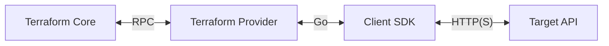

# Terraform Language

In this section, you will learn how to do the following:

- Find, use, and configure Terraform providers.
- Use resources and data sources to manage infrastructure.
- Describe the difference between attributes, arguments, and meta-arguments.
- Declare implicit and explicit dependencies.
- Use variables to pass in dynamic configuration.
- Understand the different variable types.
- Pass variable values using CLI options, variable files, and environment variables.
- Output information about your managed infrastructure.
- Create an abstraction for complex operations using local variables.

## Providers

Providers are plugins that Terraform uses to communicate with upstream APIs.



### Finding Providers

Providers can be found on the
[Terraform Registry](https://registry.terraform.io/).

### Requiring Providers

Once you've found a provider, require it in your Terraform configuration in
order to use it.

```hcl
terraform {
  required_providers {
    aws = {
      source  = "hashicorp/aws"
      version = "~> 4.0"
    }
  }
}
```

### Configuring Providers

Most providers need to be configured before they can be used. Configuration
varies per provider but commonly includes setting API credentials, a region,
and any other information a provider needs to successfully function.

Providers are configured using `provider` blocks.

```hcl
provider "aws" {}
```

### Aliasing Providers

To define multiple configurations for the same provider, create a provider
alias. This is useful when you want to use the same provider in slightly
different ways, such as supporting multiple regions for a cloud platform.

```hcl
provider "aws" {}

provider "aws" {
  alias  = "secondary"
  region = "us-west-1"
}
```

Resources that do not specify a provider will use the default, or unaliased,
provider.

```hcl
resource "aws_instance" "app" {
  ami           = "ami-007855ac798b5175e"
  instance_type = "t3.micro"
}
```

To use an aliased provider within a resource, pass in the `provider` attribute.

```hcl
resource "aws_instance" "app" {
  provider      = aws.secondary
  ami           = "ami-007855ac798b5175e"
  instance_type = "t3.micro"
}
```

## Resources

Resources represent the infrastructure that Terraform should create, read,
update, or delete. Examples of resources include AWS EC2 instances, Azure
virtual networks, GitHub repositories, PagerDuty schedules, etc.

A provider declares which resources it supports.

### Defining Resources

Resources are defined using `resource` blocks.

```hcl
resource "aws_instance" "app" {
  ami           = "ami-007855ac798b5175e"
  instance_type = "t3.micro"
}
```

`resource` blocks expect two labels; the resource type (`aws_instance`) and the
resource name (`app`).

Together, the resource type and resource name serve as a unique identifier for
a resource.

```
aws_instance.app
```

### Resource Types

Resource types follow the syntax `PROVIDER_RESOURCE`.

For example, the `aws_instance` resource type refers to the `instance` resource
within the `aws` provider. Similarly, the `azurerm_linux_virtual_machine`
resource type refers to the `linux_virtual_machine` resource within the
`azurerm` provider.

### Attributes vs. Arguments

Every resource has attributes associated with it that differ depending on the
resource type.

```hcl
resource "aws_instance" "app" {
  ami           = "ami-007855ac798b5175e"
  instance_type = "t3.micro"
}
```

Attributes that you can set are called arguments. Attributes that you cannot
set are called read-only attributes. The documentation for a resource details
which attributes are arguments and which attributes are read-only attributes.

Some attributes will not be known until after a resource is created. For
example, an instance's public IP address.

We'll use the term attributes to refer to both attributes and arguments and
only make a distinction when necessary.

### Accessing Resource Attributes

Resource attributes can be accessed using the syntax `TYPE.NAME.ATTRIBUTE`.

```hcl
resource "aws_instance" "app" {
  ami           = "ami-007855ac798b5175e"
  instance_type = "t3.micro"
  key_name      = aws_key_pair.app.key_name
}

resource "aws_key_pair" "app" {
  key_name   = "app"
  public_key = "ssh-ed25519 AAAAC3NzaC1lZDI1NTE5AAAAIETEma9o59PQm3venxMkocCM8mifE0hspFm5XsYeccw8"
}
```

### Meta-Arguments

Resources support the following meta-arguments that can be used to change their
behavior:

- `depends_on` - Define explicit dependencies.
- `count` - Create multiple resources using indices.
- `for_each` - Create multiple resources using uniquely named keys.
- `provider` - Use a specific aliased provider.
- `lifecycle` - Customize the resource lifecycle.
- `provisioner` - Provision a given resource after creation or destruction.

### Resource Dependencies

Resources can have implicit or explicit dependencies on other resources.

Resources without dependencies will be created, updated, or destroyed in
parallel.

#### Implicit Dependencies

When one resource accesses an attribute from another resource, it creates an
implicit dependency between those resources.

```hcl
resource "aws_instance" "app" {
  ami           = "ami-007855ac798b5175e"
  instance_type = "t3.micro"
  key_name      = aws_key_pair.app.key_name
}

resource "aws_key_pair" "app" {
  key_name   = "app"
  public_key = "ssh-ed25519 AAAAC3NzaC1lZDI1NTE5AAAAIETEma9o59PQm3venxMkocCM8mifE0hspFm5XsYeccw8"
}
```

#### Explicit Dependencies

Use the `depends_on` meta-argument to create a resource dependency that
Terraform cannot infer.

```hcl
resource "aws_instance" "db" {
  ami           = "ami-007855ac798b5175e"
  instance_type = "t3.micro"
  key_name      = aws_key_pair.app.key_name
}

resource "aws_instance" "app" {
  depends_on    = [aws_instance.db]
  ami           = "ami-007855ac798b5175e"
  instance_type = "t3.micro"
  key_name      = aws_key_pair.app.key_name
}
```

## Data Sources 

Data sources are a special kind of Terraform resource that reads information
and exposes that information for use within your Terraform configuration.

Each provider declares which data sources it supports.

### Defining Data Sources

Data sources are defined using `data` blocks.

```hcl
data "aws_ami" "ubuntu" {
  most_recent = true

  filter {
    name   = "name"
    values = ["ubuntu/images/hvm-ssd/ubuntu-jammy-22.04-amd64-server-*"]
  }

  filter {
    name   = "virtualization-type"
    values = ["hvm"]
  }

  owners = ["099720109477"] # Canonical's AWS account ID.
}
```

`data` blocks expect two labels; the data source type (`aws_ami`) and the data
source name (`ubuntu`).

Together, the `data` prefix, the data source type, and the data source name
serve as a unique identifier for a data source.

```hcl
data.aws_ami.ubuntu
```

### Data Source Types

Like resource types, data source types follow the syntax `PROVIDER_DATASOURCE`.

The `aws_ami` data source type refers to the `ami` data source within the `aws`
provider.

### Accessing Data Source Attributes

Data source attributes can be accessed using the syntax
`data.TYPE.NAME.ATTRIBUTE`.

```hcl
data "aws_ami" "ubuntu" {
  most_recent = true

  filter {
    name   = "name"
    values = ["ubuntu/images/hvm-ssd/ubuntu-jammy-22.04-amd64-server-*"]
  }

  filter {
    name   = "virtualization-type"
    values = ["hvm"]
  }

  owners = ["099720109477"] # Canonical's AWS account ID.
}

resource "aws_instance" "app" {
  ami           = data.aws_ami.ubuntu.id
  instance_type = "t3.micro"
}
```

### Data Source Dependencies

Like resources, data sources can have implicit and explicit dependencies.
However, it's recommended to keep data sources dependencies to a minimum.

Data sources without dependencies will be read in parallel.

### Meta-Arguments

Data sources support all of the meta-arguments that resources do except
`lifecycle`.

## Variables

Variables let you dynamically pass information to your Terraform configuration
without modifying it. Variables are similar to function arguments.

Variables must be declared before they can be used.

### Declaring Variables

Variables are declared using `variable` blocks.

```hcl
variable "ssh_public_key" {}
```

`variable` blocks expect one label; the variable name (`ssh_public_key`).

Together, the `var` prefix and the variable name serve as a unique identifier
for a variable.

```hcl
var.ssh_public_key
```

### Variable Arguments

Variables accept the following arguments:

- `default` - A default value for the variable.
- `type` - The variable type.
- `description` - Information about the variable.
- `validation` - A block to define validation rules, usually in addition to
  type constraints.
- `sensitive` - Limits Terraform output when the variable is used in
  configuration.
- `nullable` - Whether or not the variable can be `null`.

#### Required Variables

Variables without a `default` attribute are required variables whose value must
be passed by the caller.

```hcl
variable "ssh_public_key" {}
```

#### Optional Variables

Use the `default` attribute to make a variable optional and set a default value
for it.

```hcl
variable "ssh_public_key" {
  default = "ssh-ed25519 AAAAC3NzaC1lZDI1NTE5AAAAIETEma9o59PQm3venxMkocCM8mifE0hspFm5XsYeccw8"
}
```

### Variable Types

Use the `type` attribute to explicitly set a type for a variable.

```hcl
variable "ssh_public_key" {
  type    = string
  default = "ssh-ed25519 AAAAC3NzaC1lZDI1NTE5AAAAIETEma9o59PQm3venxMkocCM8mifE0hspFm5XsYeccw8"
}
```

Variables can be any of the following types:

- `string`
- `number`
- `bool`
- `list(T)`
- `set(T)`
- `map(T)`
- `object({ ATTRIBUTE = T, ... })`
- `tuple([T, ...])`
- `any`

```hcl
variable "some_string" {
  type    = string
  default = "Hello, World!"
}

variable "some_number" {
  type    = number
  default = 0
}

variable "some_bool" {
  type    = bool
  default = false
}

variable "some_list" {
  type    = list(string)
  default = ["app01", "app02"]
}

variable "some_set" {
  type    = set(string)
  default = ["app01", "app02"]
}

variable "some_map" {
  type = map(string)
  default = {
    Environment = "Production"
  }
}

variable "some_object" {
  type = object({
    name = string,
    age  = number,
  })
  default = {
    name = "Matthew Sanabria",
    age  = 30,
  }
}

variable "some_tuple" {
  type    = tuple([string, number])
  default = ["Matthew Sanabria", 30]
}
```

### Accessing Variable Values

Variable values can be accessed using the syntax `var.NAME`.

```hcl
variable "ssh_public_key" {
  type = string
}

resource "aws_instance" "app" {
  ami           = data.aws_ami.ubuntu.id
  instance_type = "t3.micro"
  key_name      = aws_key_pair.app.key_name
}

resource "aws_key_pair" "app" {
  key_name   = "app"
  public_key = var.ssh_public_key
}
```

### Passing Variable Values

Variable values can be passed using prompts, CLI options, variable files, and
environment variables.

#### Prompts

Terraform will prompt for required variables when they are not provided by other
means.

```
> terraform plan
var.ssh_public_key
  Enter a value:
```

#### CLI Options

Use the `-var` CLI option to pass a value to a variable.

```
> terraform plan -var='ssh_public_key=ssh-ed25519 AAAAC3NzaC1lZDI1NTE5AAAAIETEma9o59PQm3venxMkocCM8mifE0hspFm5XsYeccw8'
data.aws_ami.ubuntu: Reading...
data.aws_ami.ubuntu: Read complete after 0s [id=ami-0aa2b7722dc1b5612]

Terraform used the selected providers to generate the following execution plan. Resource actions are
indicated with the following symbols:
  + create

Terraform will perform the following actions:

  # aws_instance.app will be created
  + resource "aws_instance" "app" {
      ...
    }

  # aws_key_pair.app will be created
  + resource "aws_key_pair" "app" {
      ...
    }

  # aws_security_group.app will be created
  + resource "aws_security_group" "app" {
      ...
    }

Plan: 3 to add, 0 to change, 0 to destroy.
```

#### Variable Files

Variable values can be specified in variable files. Variable files have the
file extension `.tfvars` for HCL and `tfvars.json` for JSON.

```
> cat myvars.tfvars
ssh_public_key = "ssh-ed25519 AAAAC3NzaC1lZDI1NTE5AAAAIETEma9o59PQm3venxMkocCM8mifE0hspFm5XsYeccw8"

> terraform plan -var-file myvars.tfvars
data.aws_ami.ubuntu: Reading...
data.aws_ami.ubuntu: Read complete after 0s [id=ami-0aa2b7722dc1b5612]

Terraform used the selected providers to generate the following execution plan. Resource actions are
indicated with the following symbols:
  + create

Terraform will perform the following actions:

  # aws_instance.app will be created
  + resource "aws_instance" "app" {
      ...
    }

  # aws_key_pair.app will be created
  + resource "aws_key_pair" "app" {
      ...
    }

  # aws_security_group.app will be created
  + resource "aws_security_group" "app" {
      ...
    }

Plan: 3 to add, 0 to change, 0 to destroy.
```

##### Automatically Loading Variable Files

The following variable files are automatically loaded by Terraform:

- `terraform.tfvars`
- `terraform.tfvars.json`
- `*.auto.tfvars`
- `*.auto.tfvars.json`

#### Environment Variables

Variable values can be read from environment variables in the format
`TF_VAR_NAME` where `NAME` is the variable name.

```
> export TF_VAR_ssh_public_key="ssh-ed25519 AAAAC3NzaC1lZDI1NTE5AAAAIETEma9o59PQm3venxMkocCM8mifE0hspFm5XsYeccw8"

> terraform plan
data.aws_ami.ubuntu: Reading...
data.aws_ami.ubuntu: Read complete after 0s [id=ami-0aa2b7722dc1b5612]

Terraform used the selected providers to generate the following execution plan. Resource actions are
indicated with the following symbols:
  + create

Terraform will perform the following actions:

  # aws_instance.app will be created
  + resource "aws_instance" "app" {
      ...
    }

  # aws_key_pair.app will be created
  + resource "aws_key_pair" "app" {
      ...
    }

  # aws_security_group.app will be created
  + resource "aws_security_group" "app" {
      ...
    }

Plan: 3 to add, 0 to change, 0 to destroy.
```

## Outputs

Outputs let you expose information from your Terraform configuration. This
information can be read on the command line and used by other Terraform
configurations. Outputs are similar to function return values.

Outputs must be defined before they will be exposed.

### Defining Outputs

Outputs are defined using `output` blocks.

```hcl
output "ssh_info" {
  value = "ssh -l ubuntu ${aws_instance.app.public_ip}"
}
```

`output` blocks expect one label; the output name (`ssh_info`).

The output name is the name the output value will be exposed as.

### Output Arguments

Outputs accept the following arguments:

- `value` - The value to output.
- `description` - Information about the output.
- `sensitive` - Limits Terraform output when the output is used in
  configuration.

### Viewing Output Values

Output values can be viewed after Terraform configuration is applied.

```
> terraform apply
...
Apply complete! Resources: 3 added, 0 changed, 0 destroyed.

Outputs:

ssh_info = "ssh -l ubuntu 3.88.231.80"
```

Outputs can also be viewed using `terraform output`.

```
> terraform output
ssh_info = "ssh -l ubuntu 3.88.231.80"
```

Pass the `-json` CLI argument to view an output in JSON format.

```
> terraform output -json
{
  "ssh_info": {
    "sensitive": false,
    "type": "string",
    "value": "ssh -l ubuntu 3.88.231.80"
  }
}
```

## Locals

Locals let you assign a name to an expression. This allows you to use that name
instead of repeating a potentially complex expression multiple times. Locals
are similar to temporary variables within functions.

Locals must be defined before they can be used.

### Defining Locals

Locals are defined using `locals` blocks.

```hcl
locals {
  ssh_info = "ssh -l ubuntu ${aws_instance.app.public_ip}"
}
```

The `locals` block expects no labels.

Within a locals block you can define multiple key value pairs. Each key is the
local name and each value is the local value.

### Accessing Local Values

Local values can be accessed using the syntax `local.NAME`.

```hcl
locals {
  ssh_info = "ssh -l ubuntu ${aws_instance.app.public_ip}"
}

output "ssh_info" {
  value = local.ssh_info
}
```
