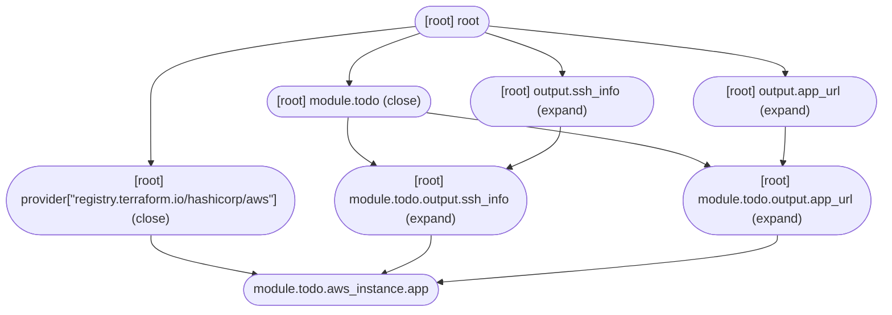

# State Management

In this section, you will learn how to do the following:

- Inspect the resources that are managed by Terraform.
- Import existing infrastructure into Terraform.
- Modify information about the resources managed by Terraform.
- Describe the process Terraform follows to refresh its state.
- Use the `terraform_remote_state` data source to fetch information about
  infrastructure managed by another Terraform configuration.
- Understand secrets are stored in Terraform state.

## Inspecting Infrastructure

Terraform provides commands that you can use to inspect the infrastructure
Terraform manages.

### Graphing Infrastructure

The first of these commands is `terraform graph`, which allows you to view your
managed infrastructure as a directed graph presented in the
[DOT graph description language](https://en.wikipedia.org/wiki/DOT_%28graph_description_language%29).

```
> terraform graph
digraph {
	compound = "true"
	newrank = "true"
	subgraph "root" {
		"[root] module.todo.aws_db_instance.db (expand)" [label = "module.todo.aws_db_instance.db", shape = "box"]
		"[root] module.todo.aws_instance.app (expand)" [label = "module.todo.aws_instance.app", shape = "box"]
		"[root] module.todo.aws_key_pair.app (expand)" [label = "module.todo.aws_key_pair.app", shape = "box"]
		"[root] module.todo.aws_security_group.app (expand)" [label = "module.todo.aws_security_group.app", shape = "box"]
		"[root] module.todo.aws_security_group.db (expand)" [label = "module.todo.aws_security_group.db", shape = "box"]
		"[root] module.todo.data.aws_ami.ubuntu (expand)" [label = "module.todo.data.aws_ami.ubuntu", shape = "box"]
		"[root] module.todo.data.aws_vpc.default (expand)" [label = "module.todo.data.aws_vpc.default", shape = "box"]
		"[root] provider[\"registry.terraform.io/hashicorp/aws\"]" [label = "provider[\"registry.terraform.io/hashicorp/aws\"]", shape = "diamond"]
		"[root] var.ssh_public_key" [label = "var.ssh_public_key", shape = "note"]
		"[root] module.todo (close)" -> "[root] module.todo.output.app_url (expand)"
		"[root] module.todo (close)" -> "[root] module.todo.output.ssh_info (expand)"
		"[root] module.todo.aws_db_instance.db (expand)" -> "[root] module.todo.aws_security_group.db (expand)"
		"[root] module.todo.aws_db_instance.db (expand)" -> "[root] module.todo.var.db_name (expand)"
		"[root] module.todo.aws_db_instance.db (expand)" -> "[root] module.todo.var.db_password (expand)"
		"[root] module.todo.aws_db_instance.db (expand)" -> "[root] module.todo.var.db_user (expand)"
		"[root] module.todo.aws_instance.app (expand)" -> "[root] module.todo.aws_key_pair.app (expand)"
		"[root] module.todo.aws_instance.app (expand)" -> "[root] module.todo.data.aws_ami.ubuntu (expand)"
		"[root] module.todo.aws_instance.app (expand)" -> "[root] module.todo.local.user_data (expand)"
		"[root] module.todo.aws_instance.app (expand)" -> "[root] module.todo.var.instance_type (expand)"
		"[root] module.todo.aws_key_pair.app (expand)" -> "[root] module.todo.var.ssh_public_key (expand)"
		"[root] module.todo.aws_key_pair.app (expand)" -> "[root] provider[\"registry.terraform.io/hashicorp/aws\"]"
		"[root] module.todo.aws_security_group.app (expand)" -> "[root] module.todo.data.aws_vpc.default (expand)"
		"[root] module.todo.aws_security_group.app (expand)" -> "[root] module.todo.var.app_port (expand)"
		"[root] module.todo.aws_security_group.db (expand)" -> "[root] module.todo.aws_security_group.app (expand)"
		"[root] module.todo.aws_security_group.db (expand)" -> "[root] module.todo.var.db_port (expand)"
		"[root] module.todo.data.aws_ami.ubuntu (expand)" -> "[root] module.todo (expand)"
		"[root] module.todo.data.aws_ami.ubuntu (expand)" -> "[root] provider[\"registry.terraform.io/hashicorp/aws\"]"
		"[root] module.todo.data.aws_vpc.default (expand)" -> "[root] module.todo (expand)"
		"[root] module.todo.data.aws_vpc.default (expand)" -> "[root] provider[\"registry.terraform.io/hashicorp/aws\"]"
		"[root] module.todo.local.user_data (expand)" -> "[root] module.todo.aws_db_instance.db (expand)"
		"[root] module.todo.local.user_data (expand)" -> "[root] module.todo.var.app_version (expand)"
		"[root] module.todo.output.app_url (expand)" -> "[root] module.todo.aws_instance.app (expand)"
		"[root] module.todo.output.ssh_info (expand)" -> "[root] module.todo.aws_instance.app (expand)"
		"[root] module.todo.var.app_port (expand)" -> "[root] module.todo (expand)"
		"[root] module.todo.var.app_version (expand)" -> "[root] module.todo (expand)"
		"[root] module.todo.var.db_name (expand)" -> "[root] module.todo (expand)"
		"[root] module.todo.var.db_password (expand)" -> "[root] module.todo (expand)"
		"[root] module.todo.var.db_port (expand)" -> "[root] module.todo (expand)"
		"[root] module.todo.var.db_user (expand)" -> "[root] module.todo (expand)"
		"[root] module.todo.var.instance_type (expand)" -> "[root] module.todo (expand)"
		"[root] module.todo.var.ssh_public_key (expand)" -> "[root] module.todo (expand)"
		"[root] module.todo.var.ssh_public_key (expand)" -> "[root] var.ssh_public_key"
		"[root] output.app_url (expand)" -> "[root] module.todo.output.app_url (expand)"
		"[root] output.ssh_info (expand)" -> "[root] module.todo.output.ssh_info (expand)"
		"[root] provider[\"registry.terraform.io/hashicorp/aws\"] (close)" -> "[root] module.todo.aws_instance.app (expand)"
		"[root] root" -> "[root] module.todo (close)"
		"[root] root" -> "[root] output.app_url (expand)"
		"[root] root" -> "[root] output.ssh_info (expand)"
		"[root] root" -> "[root] provider[\"registry.terraform.io/hashicorp/aws\"] (close)"
	}
}
```

While this text format isn't exactly pretty, it can be used by programs such as
`dot` to generate an SVG.

```
> terraform graph | dot -T svg > graph.svg
```

The resulting SVG will look similar to this:



### Printing Terraform Outputs

Outputs for a given Terraform state can be view using `terraform output`.

```
> terraform output
app_url = "http://54.198.183.16:8080"
ssh_info = "ssh -l ubuntu 54.198.183.16"
```

Outputs can be printed in JSON syntax as well.

```
> terraform output --json
{
  "app_url": {
    "sensitive": false,
    "type": "string",
    "value": "http://54.198.183.16:8080"
  },
  "ssh_info": {
    "sensitive": false,
    "type": "string",
    "value": "ssh -l ubuntu 54.198.183.16"
  }
}
```

### Showing Terraform State

The Terraform state file can be output in human-readable form using `terraform
show`.

```
> terraform show
# module.todo.data.aws_ami.ubuntu:
data "aws_ami" "ubuntu" {
    id = "ami-0f1bae6c3bedcc3b5"
    ...
}

# module.todo.data.aws_vpc.default:
data "aws_vpc" "default" {
    arn                                  = "arn:aws:ec2:us-east-1:371868434650:vpc/vpc-0bf582902425904f8"
    cidr_block                           = "172.31.0.0/16"
    cidr_block_associations              = [
        {
            association_id = "vpc-cidr-assoc-06468aedc6a7a25f7"
            cidr_block     = "172.31.0.0/16"
            state          = "associated"
        },
    ]
    default                              = true
    dhcp_options_id                      = "dopt-0b758c8574ff873a6"
    enable_dns_hostnames                 = true
    enable_dns_support                   = true
    enable_network_address_usage_metrics = false
    id                                   = "vpc-0bf582902425904f8"
    instance_tenancy                     = "default"
    main_route_table_id                  = "rtb-0d9fee7be70c58539"
    owner_id                             = "371868434650"
    tags                                 = {}
}

# module.todo.aws_db_instance.db:
resource "aws_db_instance" "db" {
    engine                                = "postgres"
    engine_version                        = "14"
    ...
}

# module.todo.aws_instance.app:
resource "aws_instance" "app" {
    ami                                  = "ami-0f1bae6c3bedcc3b5"
    id                                   = "i-05f294f2d89dbe880"
    ...
}

# module.todo.aws_key_pair.app:
resource "aws_key_pair" "app" {
    arn         = "arn:aws:ec2:us-east-1:371868434650:key-pair/todo"
    fingerprint = "FIJSqCQEGCNFZ6p4pzxOTVmEdSKM5QpLmdBsgPovWjY="
    id          = "todo"
    key_name    = "todo"
    key_pair_id = "key-07aafdf4b6021889f"
    key_type    = "ed25519"
    public_key  = "ssh-ed25519 AAAAC3NzaC1lZDI1NTE5AAAAIETEma9o59PQm3venxMkocCM8mifE0hspFm5XsYeccw8"
    tags_all    = {}
}

# module.todo.aws_security_group.app:
resource "aws_security_group" "app" {
    arn                    = "arn:aws:ec2:us-east-1:371868434650:security-group/sg-01d9c1121beb7348b"
    description            = "Security group for todo application."
    ingress                = [
        {
            cidr_blocks      = [
                "0.0.0.0/0",
            ]
            description      = "SSH"
            from_port        = 22
            ipv6_cidr_blocks = [
                "::/0",
            ]
            prefix_list_ids  = []
            protocol         = "tcp"
            security_groups  = []
            self             = false
            to_port          = 22
        },
        {
            cidr_blocks      = [
                "0.0.0.0/0",
            ]
            description      = "Todo application port."
            from_port        = 8080
            ipv6_cidr_blocks = [
                "::/0",
            ]
            prefix_list_ids  = []
            protocol         = "tcp"
            security_groups  = []
            self             = false
            to_port          = 8080
        },
    ]
    name                   = "todo"
    owner_id               = "371868434650"
    revoke_rules_on_delete = false
    tags_all               = {}
    vpc_id                 = "vpc-0bf582902425904f8"
}

# module.todo.aws_security_group.db:
resource "aws_security_group" "db" {
    arn                    = "arn:aws:ec2:us-east-1:371868434650:security-group/sg-0abc786d38205a9eb"
    description            = "Security group for todo application."
    id                     = "sg-0abc786d38205a9eb"
    ingress                = [
        {
            cidr_blocks      = []
            description      = "Todo application database access."
            from_port        = 5432
            ipv6_cidr_blocks = []
            prefix_list_ids  = []
            protocol         = "tcp"
            security_groups  = [
                "sg-01d9c1121beb7348b",
            ]
            self             = false
            to_port          = 5432
        },
    ]
    name                   = "db"
    owner_id               = "371868434650"
    revoke_rules_on_delete = false
    tags_all               = {}
    vpc_id                 = "vpc-0bf582902425904f8"
}


Outputs:

app_url = "http://54.198.183.16:8080"
ssh_info = "ssh -l ubuntu 54.198.183.16"
```

### Viewing Resources in State

The unique addresses for all infrastructure managed by Terraform can be listed
using `terraform state list`.

```
> terraform state list
module.todo.data.aws_ami.ubuntu
module.todo.data.aws_vpc.default
module.todo.aws_db_instance.db
module.todo.aws_instance.app
module.todo.aws_key_pair.app
module.todo.aws_security_group.app
module.todo.aws_security_group.db
```

To show details for a single resource, use `terraform state show ADDR` where
`ADDR` is a unique resource address retrieved from `terraform state list`.

```
> terraform state show module.todo.aws_key_pair.app
# module.todo.aws_key_pair.app:
resource "aws_key_pair" "app" {
    arn         = "arn:aws:ec2:us-east-1:371868434650:key-pair/todo"
    fingerprint = "FIJSqCQEGCNFZ6p4pzxOTVmEdSKM5QpLmdBsgPovWjY="
    id          = "todo"
    key_name    = "todo"
    key_pair_id = "key-07aafdf4b6021889f"
    key_type    = "ed25519"
    public_key  = "ssh-ed25519 AAAAC3NzaC1lZDI1NTE5AAAAIETEma9o59PQm3venxMkocCM8mifE0hspFm5XsYeccw8"
    tags_all    = {}
}
```

## Importing Infrastructure

Infrastructure created outside of Terraform can be imported into Terraform using
`terraform import`.

Before infrastructure can be imported into Terraform, a its configuration must
exist.

```
resource "aws_security_group" "foo" {}
```

If it doesn't you'll receive an error.

```
> terraform import aws_security_group.foo sg-0e8d1695aa20fcc83
Error: resource address "aws_security_group.foo" does not exist in the configuration.

Before importing this resource, please create its configuration in the root module. For example:

resource "aws_security_group" "foo" {
  # (resource arguments)
}
```

Once the resource exists in configuration, it can be imported.

```
> terraform import aws_security_group.foo sg-0e8d1695aa20fcc83
aws_security_group.foo: Importing from ID "sg-0e8d1695aa20fcc83"...
module.todo.data.aws_vpc.default: Reading...
aws_security_group.foo: Import prepared!
  Prepared aws_security_group for import
module.todo.data.aws_ami.ubuntu: Reading...
aws_security_group.foo: Refreshing state... [id=sg-0e8d1695aa20fcc83]
module.todo.data.aws_ami.ubuntu: Read complete after 0s [id=ami-0f1bae6c3bedcc3b5]
module.todo.data.aws_vpc.default: Read complete after 1s [id=vpc-0bf582902425904f8]

Import successful!

The resources that were imported are shown above. These resources are now in
your Terraform state and will henceforth be managed by Terraform.
```

However, you're not done. Attempting to plan will show Terraform wants to make
undesired changes to your newly imported infrastructure.

```
> terraform plan
module.todo.data.aws_ami.ubuntu: Reading...
module.todo.data.aws_vpc.default: Reading...
module.todo.aws_key_pair.app: Refreshing state... [id=todo]
aws_security_group.foo: Refreshing state... [id=sg-0e8d1695aa20fcc83]
module.todo.data.aws_ami.ubuntu: Read complete after 1s [id=ami-0f1bae6c3bedcc3b5]
module.todo.data.aws_vpc.default: Read complete after 1s [id=vpc-0bf582902425904f8]
module.todo.aws_security_group.app: Refreshing state... [id=sg-01d9c1121beb7348b]
module.todo.aws_security_group.db: Refreshing state... [id=sg-0abc786d38205a9eb]
module.todo.aws_db_instance.db: Refreshing state... [id=todo20230418234534268000000001]
module.todo.aws_instance.app: Refreshing state... [id=i-05f294f2d89dbe880]

Terraform used the selected providers to generate the following execution plan. Resource actions are
indicated with the following symbols:
-/+ destroy and then create replacement

Terraform will perform the following actions:

  # aws_security_group.foo must be replaced
-/+ resource "aws_security_group" "foo" {
      ~ arn                    = "arn:aws:ec2:us-east-1:371868434650:security-group/sg-0e8d1695aa20fcc83" -> (known after apply)
      ~ description            = "testing" -> "Managed by Terraform" # forces replacement
      ~ egress                 = [
          - {
              - cidr_blocks      = [
                  - "0.0.0.0/0",
                ]
              - description      = ""
              - from_port        = 0
              - ipv6_cidr_blocks = []
              - prefix_list_ids  = []
              - protocol         = "-1"
              - security_groups  = []
              - self             = false
              - to_port          = 0
            },
        ] -> (known after apply)
      ~ id                     = "sg-0e8d1695aa20fcc83" -> (known after apply)
      ~ ingress                = [
          - {
              - cidr_blocks      = [
                  - "0.0.0.0/0",
                ]
              - description      = ""
              - from_port        = -1
              - ipv6_cidr_blocks = []
              - prefix_list_ids  = []
              - protocol         = "icmp"
              - security_groups  = []
              - self             = false
              - to_port          = -1
            },
        ] -> (known after apply)
      ~ name                   = "testing" -> (known after apply)
      + name_prefix            = (known after apply)
      ~ owner_id               = "371868434650" -> (known after apply)
      + revoke_rules_on_delete = false
      - tags                   = {} -> null
      ~ tags_all               = {} -> (known after apply)
      ~ vpc_id                 = "vpc-0bf582902425904f8" -> (known after apply)
    }

Plan: 1 to add, 0 to change, 1 to destroy.
```

Update the configuration until it matches the real infrastructure.

```
resource "aws_security_group" "foo" {
  name        = "testing"
  description = "testing"

  ingress {
    from_port   = -1
    to_port     = -1
    protocol    = "icmp"
    cidr_blocks = ["0.0.0.0/0"]
  }

  egress {
    from_port   = 0
    to_port     = 0
    protocol    = "-1"
    cidr_blocks = ["0.0.0.0/0"]
  }
}
```

Then plan until Terraform shows no changes.

```
> terraform plan
module.todo.data.aws_ami.ubuntu: Reading...
module.todo.data.aws_vpc.default: Reading...
module.todo.aws_key_pair.app: Refreshing state... [id=todo]
aws_security_group.foo: Refreshing state... [id=sg-0e8d1695aa20fcc83]
module.todo.data.aws_ami.ubuntu: Read complete after 0s [id=ami-0f1bae6c3bedcc3b5]
module.todo.data.aws_vpc.default: Read complete after 1s [id=vpc-0bf582902425904f8]
module.todo.aws_security_group.app: Refreshing state... [id=sg-01d9c1121beb7348b]
module.todo.aws_security_group.db: Refreshing state... [id=sg-0abc786d38205a9eb]
module.todo.aws_db_instance.db: Refreshing state... [id=todo20230418234534268000000001]
module.todo.aws_instance.app: Refreshing state... [id=i-05f294f2d89dbe880]

No changes. Your infrastructure matches the configuration.

Terraform has compared your real infrastructure against your configuration and found no differences, so
no changes are needed.
```

## Manipulating State

Terraform exposes commands that can be used to manipulate its state.

### Replacing Resources with `-replace`

When you want a resource to be recreated during the next apply, you can tell the
plan to apply to replace it using the `-replace` option.

```
> terraform apply -replace aws_security_group.foo
module.todo.data.aws_vpc.default: Reading...
module.todo.aws_key_pair.app: Refreshing state... [id=todo]
module.todo.data.aws_ami.ubuntu: Reading...
aws_security_group.foo: Refreshing state... [id=sg-03628affc96155a3f]
module.todo.data.aws_ami.ubuntu: Read complete after 0s [id=ami-0f1bae6c3bedcc3b5]
module.todo.data.aws_vpc.default: Read complete after 0s [id=vpc-0bf582902425904f8]
module.todo.aws_security_group.app: Refreshing state... [id=sg-01d9c1121beb7348b]
module.todo.aws_security_group.db: Refreshing state... [id=sg-0abc786d38205a9eb]
module.todo.aws_db_instance.db: Refreshing state... [id=todo20230418234534268000000001]
module.todo.aws_instance.app: Refreshing state... [id=i-05f294f2d89dbe880]

Terraform used the selected providers to generate the following execution plan. Resource actions are
indicated with the following symbols:
-/+ destroy and then create replacement

Terraform will perform the following actions:

  # aws_security_group.foo will be replaced, as requested
-/+ resource "aws_security_group" "foo" {
      ~ arn                    = "arn:aws:ec2:us-east-1:371868434650:security-group/sg-03628affc96155a3f" -> (known after apply)
      ~ id                     = "sg-03628affc96155a3f" -> (known after apply)
        name                   = "testing"
      + name_prefix            = (known after apply)
      ~ owner_id               = "371868434650" -> (known after apply)
      - tags                   = {} -> null
      ~ tags_all               = {} -> (known after apply)
      ~ vpc_id                 = "vpc-0bf582902425904f8" -> (known after apply)
        # (4 unchanged attributes hidden)
    }

Plan: 1 to add, 0 to change, 1 to destroy.

Do you want to perform these actions?
  Terraform will perform the actions described above.
  Only 'yes' will be accepted to approve.

  Enter a value: yes

aws_security_group.foo: Destroying... [id=sg-03628affc96155a3f]
aws_security_group.foo: Destruction complete after 0s
aws_security_group.foo: Creating...
aws_security_group.foo: Creation complete after 3s [id=sg-081395d74b8028656]

Apply complete! Resources: 1 added, 0 changed, 1 destroyed.
```

### Replacing Resources with Taint

Older versions of Terraform use tainting to recreate a resource.

```
> terraform taint aws_security_group.foo
Resource instance aws_security_group.foo has been marked as tainted.
```

The resource will be marked as tainted within the state, which you can verify
with `terraform state show`.

```
> terraform state show aws_security_group.foo
# aws_security_group.foo: (tainted)
resource "aws_security_group" "foo" {
    arn         = "arn:aws:ec2:us-east-1:371868434650:security-group/sg-0e8d1695aa20fcc83"
    description = "testing"
    egress      = [
        {
            cidr_blocks      = [
                "0.0.0.0/0",
            ]
            description      = ""
            from_port        = 0
            ipv6_cidr_blocks = []
            prefix_list_ids  = []
            protocol         = "-1"
            security_groups  = []
            self             = false
            to_port          = 0
        },
    ]
    id          = "sg-0e8d1695aa20fcc83"
    ingress     = [
        {
            cidr_blocks      = [
                "0.0.0.0/0",
            ]
            description      = ""
            from_port        = -1
            ipv6_cidr_blocks = []
            prefix_list_ids  = []
            protocol         = "icmp"
            security_groups  = []
            self             = false
            to_port          = -1
        },
    ]
    name        = "testing"
    owner_id    = "371868434650"
    tags        = {}
    tags_all    = {}
    vpc_id      = "vpc-0bf582902425904f8"
}
```

Apply your changes to destroy the tainted resource and recreate it.

```
> terraform apply
module.todo.aws_key_pair.app: Refreshing state... [id=todo]
module.todo.data.aws_vpc.default: Reading...
module.todo.data.aws_ami.ubuntu: Reading...
aws_security_group.foo: Refreshing state... [id=sg-0e8d1695aa20fcc83]
module.todo.data.aws_ami.ubuntu: Read complete after 0s [id=ami-0f1bae6c3bedcc3b5]
module.todo.data.aws_vpc.default: Read complete after 0s [id=vpc-0bf582902425904f8]
module.todo.aws_security_group.app: Refreshing state... [id=sg-01d9c1121beb7348b]
module.todo.aws_security_group.db: Refreshing state... [id=sg-0abc786d38205a9eb]
module.todo.aws_db_instance.db: Refreshing state... [id=todo20230418234534268000000001]
module.todo.aws_instance.app: Refreshing state... [id=i-05f294f2d89dbe880]

Terraform used the selected providers to generate the following execution plan. Resource actions are
indicated with the following symbols:
-/+ destroy and then create replacement

Terraform will perform the following actions:

  # aws_security_group.foo is tainted, so must be replaced
-/+ resource "aws_security_group" "foo" {
      ~ arn                    = "arn:aws:ec2:us-east-1:371868434650:security-group/sg-0e8d1695aa20fcc83" -> (known after apply)
      ~ id                     = "sg-0e8d1695aa20fcc83" -> (known after apply)
        name                   = "testing"
      + name_prefix            = (known after apply)
      ~ owner_id               = "371868434650" -> (known after apply)
      + revoke_rules_on_delete = false
      - tags                   = {} -> null
      ~ tags_all               = {} -> (known after apply)
      ~ vpc_id                 = "vpc-0bf582902425904f8" -> (known after apply)
        # (3 unchanged attributes hidden)
    }

Plan: 1 to add, 0 to change, 1 to destroy.

Do you want to perform these actions?
  Terraform will perform the actions described above.
  Only 'yes' will be accepted to approve.

  Enter a value: yes

aws_security_group.foo: Destroying... [id=sg-0e8d1695aa20fcc83]
aws_security_group.foo: Destruction complete after 0s
aws_security_group.foo: Creating...
aws_security_group.foo: Creation complete after 3s [id=sg-03628affc96155a3f]

Apply complete! Resources: 1 added, 0 changed, 1 destroyed.
```

If you accidentally tainted a resource, you can untaint it.

```
> terraform untaint aws_security_group.foo
Resource instance aws_security_group.foo has been successfully untainted.
```

Terraform will no longer attempt to replace the untainted resource.

```
> terraform plan
module.todo.data.aws_vpc.default: Reading...
module.todo.aws_key_pair.app: Refreshing state... [id=todo]
aws_security_group.foo: Refreshing state... [id=sg-03628affc96155a3f]
module.todo.data.aws_ami.ubuntu: Reading...
module.todo.data.aws_ami.ubuntu: Read complete after 1s [id=ami-0f1bae6c3bedcc3b5]
module.todo.data.aws_vpc.default: Read complete after 1s [id=vpc-0bf582902425904f8]
module.todo.aws_security_group.app: Refreshing state... [id=sg-01d9c1121beb7348b]
module.todo.aws_security_group.db: Refreshing state... [id=sg-0abc786d38205a9eb]
module.todo.aws_db_instance.db: Refreshing state... [id=todo20230418234534268000000001]
module.todo.aws_instance.app: Refreshing state... [id=i-05f294f2d89dbe880]

No changes. Your infrastructure matches the configuration.

Terraform has compared your real infrastructure against your configuration and found no differences, so
no changes are needed.
```

### Moving Resources

Terraform supports moving resources around in its state and in its
configuration. However, moving resources around is not a simple as changing its
name in the configuration and applying it.

Let's say we rename a module in our configuration.

```diff
--- main.tf	2023-04-18 21:38:07.649372811 -0400
+++ main.tf	2023-04-18 21:38:12.848422672 -0400
@@ -32,16 +32,16 @@
   }
 }
 
-module "todo" {
+module "todo_v2" {
   source = "./modules/todo"
 
   ssh_public_key = var.ssh_public_key
 }
 
 output "ssh_info" {
-  value = module.todo.ssh_info
+  value = module.todo_v2.ssh_info
 }
 
 output "app_url" {
-  value = module.todo.app_url
+  value = module.todo_v2.app_url
 }
```

Trying to plan this results in an error.

```
> terraform plan
╷
│ Error: Module not installed
│ 
│   on main.tf line 35:
│   35: module "todo_v2" {
│ 
│ This module is not yet installed. Run "terraform init" to install all modules required by this
│ configuration.
╵
```

Running `terraform init` seems to work.

```
> terraform init

Initializing the backend...
Initializing modules...
- todo_v2 in modules/todo

Initializing provider plugins...
- Reusing previous version of hashicorp/aws from the dependency lock file
- Using previously-installed hashicorp/aws v4.63.0

Terraform has been successfully initialized!
```

But now `terraform plan` shows it wants to recreate everything in that module.

```
> terraform plan
...
Plan: 5 to add, 0 to change, 5 to destroy.
```

Instead, use `terraform state mv` to move all of the resources from one name to
a new name.

```
> terraform state list
aws_security_group.foo
module.todo.data.aws_ami.ubuntu
module.todo.data.aws_vpc.default
module.todo.aws_db_instance.db
module.todo.aws_instance.app
module.todo.aws_key_pair.app
module.todo.aws_security_group.app
module.todo.aws_security_group.db

> terraform state mv module.todo.data.aws_ami.ubuntu module.todo_v2.data.aws_ami.ubuntu
Move "module.todo.data.aws_ami.ubuntu" to "module.todo_v2.data.aws_ami.ubuntu"

> terraform state mv module.todo.data.aws_vpc.default module.todo_v2.data.aws_vpc.default
Move "module.todo.data.aws_vpc.default" to "module.todo_v2.data.aws_vpc.default"
Successfully moved 1 object(s).

> terraform state mv module.todo.aws_db_instance.db module.todo_v2.aws_db_instance.db
Move "module.todo.aws_db_instance.db" to "module.todo_v2.aws_db_instance.db"
Successfully moved 1 object(s).

> terraform state mv module.todo.aws_instance.app module.todo_v2.aws_instance.app
Move "module.todo.aws_instance.app" to "module.todo_v2.aws_instance.app"
Successfully moved 1 object(s).

> terraform state mv module.todo.aws_key_pair.app module.todo_v2.aws_key_pair.app
Move "module.todo.aws_key_pair.app" to "module.todo_v2.aws_key_pair.app"
Successfully moved 1 object(s).

> terraform state mv module.todo.aws_security_group.app module.todo_v2.aws_security_group.app
Move "module.todo.aws_security_group.app" to "module.todo_v2.aws_security_group.app"
Successfully moved 1 object(s).

> terraform state mv module.todo.aws_security_group.db module.todo_v2.aws_security_group.db
Move "module.todo.aws_security_group.db" to "module.todo_v2.aws_security_group.db"
Successfully moved 1 object(s).

> terraform state list
aws_security_group.foo
module.todo_v2.data.aws_ami.ubuntu
module.todo_v2.data.aws_vpc.default
module.todo_v2.aws_db_instance.db
module.todo_v2.aws_instance.app
module.todo_v2.aws_key_pair.app
module.todo_v2.aws_security_group.app
module.todo_v2.aws_security_group.db
```

Now the plan shows no changes.

```
> terraform plan
module.todo_v2.data.aws_vpc.default: Reading...
module.todo_v2.data.aws_ami.ubuntu: Reading...
module.todo_v2.aws_key_pair.app: Refreshing state... [id=todo]
aws_security_group.foo: Refreshing state... [id=sg-081395d74b8028656]
module.todo_v2.data.aws_ami.ubuntu: Read complete after 1s [id=ami-0f1bae6c3bedcc3b5]
module.todo_v2.data.aws_vpc.default: Read complete after 1s [id=vpc-0bf582902425904f8]
module.todo_v2.aws_security_group.app: Refreshing state... [id=sg-01d9c1121beb7348b]
module.todo_v2.aws_security_group.db: Refreshing state... [id=sg-0abc786d38205a9eb]
module.todo_v2.aws_db_instance.db: Refreshing state... [id=todo20230418234534268000000001]
module.todo_v2.aws_instance.app: Refreshing state... [id=i-05f294f2d89dbe880]

No changes. Your infrastructure matches the configuration.
```

That's a lot of commands. Fortunately there's an easier way to do this with the
`moved` block.

Let's add a `moved` block to rename our module from `todo_v2` back to `todo`.

```diff
--- main.tf	2023-04-18 21:57:05.150233505 -0400
+++ main.tf	2023-04-18 21:56:23.216835981 -0400
@@ -32,6 +32,11 @@
   }
 }
 
+moved {
+  from = module.todo_v2
+  to   = module.todo
+}
+
 module "todo_v2" {
   source = "./modules/todo"
```

When you plan this, Terraform shows an error.

```
> terraform plan
module.todo.aws_security_group.db: Refreshing state... [id=sg-0abc786d38205a9eb]
module.todo_v2.data.aws_ami.ubuntu: Reading...
module.todo.aws_db_instance.db: Refreshing state... [id=todo20230418234534268000000001]
module.todo.aws_key_pair.app: Refreshing state... [id=todo]
module.todo.aws_security_group.app: Refreshing state... [id=sg-01d9c1121beb7348b]
module.todo_v2.data.aws_vpc.default: Reading...
aws_security_group.foo: Refreshing state... [id=sg-081395d74b8028656]
module.todo.aws_instance.app: Refreshing state... [id=i-05f294f2d89dbe880]
module.todo_v2.data.aws_ami.ubuntu: Read complete after 1s [id=ami-0f1bae6c3bedcc3b5]
module.todo_v2.data.aws_vpc.default: Read complete after 1s [id=vpc-0bf582902425904f8]
╷
│ Error: Moved object still exists
│ 
│   on main.tf line 35:
│   35: moved {
│ 
│ This statement declares a move from module.todo_v2, but that module call is still declared at
│ main.tf:40,1.
│ 
│ Change your configuration so that this call will be declared as module.todo instead.
╵
```

Update the rest of the configuration to use the new name.

```diff
--- main.tf	2023-04-18 21:57:05.150233505 -0400
+++ main.tf	2023-04-18 21:59:00.308325181 -0400
@@ -32,16 +32,21 @@
   }
 }
 
-module "todo_v2" {
+moved {
+  from = module.todo_v2
+  to   = module.todo
+}
+
+module "todo" {
   source = "./modules/todo"
 
   ssh_public_key = var.ssh_public_key
 }
 
 output "ssh_info" {
-  value = module.todo_v2.ssh_info
+  value = module.todo.ssh_info
 }
 
 output "app_url" {
-  value = module.todo_v2.app_url
+  value = module.todo.app_url
 }
```

Now the plan will show the move.

```
> terraform plan
module.todo.aws_key_pair.app: Refreshing state... [id=todo]
module.todo.data.aws_vpc.default: Reading...
module.todo.data.aws_ami.ubuntu: Reading...
aws_security_group.foo: Refreshing state... [id=sg-081395d74b8028656]
module.todo.data.aws_ami.ubuntu: Read complete after 0s [id=ami-0f1bae6c3bedcc3b5]
module.todo.data.aws_vpc.default: Read complete after 1s [id=vpc-0bf582902425904f8]
module.todo.aws_security_group.app: Refreshing state... [id=sg-01d9c1121beb7348b]
module.todo.aws_security_group.db: Refreshing state... [id=sg-0abc786d38205a9eb]
module.todo.aws_db_instance.db: Refreshing state... [id=todo20230418234534268000000001]
module.todo.aws_instance.app: Refreshing state... [id=i-05f294f2d89dbe880]

Terraform will perform the following actions:

  # module.todo_v2.aws_db_instance.db has moved to module.todo.aws_db_instance.db
    resource "aws_db_instance" "db" {
        id                                    = "todo20230418234534268000000001"
        name                                  = "todo"
        tags                                  = {}
        # (52 unchanged attributes hidden)
    }

  # module.todo_v2.aws_instance.app has moved to module.todo.aws_instance.app
    resource "aws_instance" "app" {
        id                                   = "i-05f294f2d89dbe880"
        tags                                 = {}
        # (33 unchanged attributes hidden)

        # (7 unchanged blocks hidden)
    }

  # module.todo_v2.aws_key_pair.app has moved to module.todo.aws_key_pair.app
    resource "aws_key_pair" "app" {
        id          = "todo"
        tags        = {}
        # (7 unchanged attributes hidden)
    }

  # module.todo_v2.aws_security_group.app has moved to module.todo.aws_security_group.app
    resource "aws_security_group" "app" {
        id                     = "sg-01d9c1121beb7348b"
        name                   = "todo"
        tags                   = {}
        # (8 unchanged attributes hidden)
    }

  # module.todo_v2.aws_security_group.db has moved to module.todo.aws_security_group.db
    resource "aws_security_group" "db" {
        id                     = "sg-0abc786d38205a9eb"
        name                   = "db"
        tags                   = {}
        # (8 unchanged attributes hidden)
    }

Plan: 0 to add, 0 to change, 0 to destroy.
```

Apply this to complete the move.

```
> terraform apply
...
Plan: 0 to add, 0 to change, 0 to destroy.

Do you want to perform these actions?
  Terraform will perform the actions described above.
  Only 'yes' will be accepted to approve.

  Enter a value: yes


Apply complete! Resources: 0 added, 0 changed, 0 destroyed.
```

```
> terraform state list
aws_security_group.foo
module.todo.data.aws_ami.ubuntu
module.todo.data.aws_vpc.default
module.todo.aws_db_instance.db
module.todo.aws_instance.app
module.todo.aws_key_pair.app
module.todo.aws_security_group.app
module.todo.aws_security_group.db
```

At this point, it's safe to remove the `moved` block from the configuration.

```diff
--- main.tf	2023-04-18 22:09:56.330517610 -0400
+++ main.tf	2023-04-18 22:10:48.195999811 -0400
@@ -32,11 +32,6 @@
   }
 }
 
-moved {
-  from = module.todo_v2
-  to   = module.todo
-}
-
 module "todo" {
   source = "./modules/todo"
```

### Removing Resources

To remove a resource from being managed by Terraform, use `terraform state rm`.

```
> terraform state list
aws_security_group.foo
module.todo.data.aws_ami.ubuntu
module.todo.data.aws_vpc.default
module.todo.aws_db_instance.db
module.todo.aws_instance.app
module.todo.aws_key_pair.app
module.todo.aws_security_group.app
module.todo.aws_security_group.db

> terraform state rm aws_security_group.foo
Removed aws_security_group.foo
Successfully removed 1 resource instance(s).

> terraform state list
module.todo.data.aws_ami.ubuntu
module.todo.data.aws_vpc.default
module.todo.aws_db_instance.db
module.todo.aws_instance.app
module.todo.aws_key_pair.app
module.todo.aws_security_group.app
module.todo.aws_security_group.db
```

Don't forget to remove the resource from configuration so Terraform doesn't try
to create it.

```diff
--- main.tf	2023-04-18 22:11:43.211511280 -0400
+++ main.tf	2023-04-18 22:11:50.244576664 -0400
@@ -13,25 +13,6 @@
   type = string
 }
 
-resource "aws_security_group" "foo" {
-  name        = "testing"
-  description = "testing"
-
-  ingress {
-    from_port   = -1
-    to_port     = -1
-    protocol    = "icmp"
-    cidr_blocks = ["0.0.0.0/0"]
-  }
-
-  egress {
-    from_port   = 0
-    to_port     = 0
-    protocol    = "-1"
-    cidr_blocks = ["0.0.0.0/0"]
-  }
-}
-
 module "todo" {
   source = "./modules/todo"
```

The removed resource must be imported again to be managed by Terraform.

### Replacing Providers

You may create infrastructure using a public provider and later decide to fork
that provider to provide custom patches. Your configuration and state will need
to be updated to replace the old provider with the new provider.

Update your configuration to use the new provider.

```diff
--- main.tf	2023-04-18 22:17:42.803854370 -0400
+++ main.tf	2023-04-18 22:17:23.796677663 -0400
@@ -1,7 +1,7 @@
 terraform {
   required_providers {
     aws = {
-      source  = "hashicorp/aws"
+      source  = "registry.example.com/foo/aws"
       version = "~> 4.0"
     }
   }
```

Then use `terraform state replace-provider` to update the state file
accordingly.

```
> terraform state replace-provider hashicorp/aws registry.example.com/foo/aws
Terraform will perform the following actions:

  ~ Updating provider:
    - registry.terraform.io/hashicorp/aws
    + registry.example.com/foo/aws

Changing 8 resources:

  module.todo.data.aws_vpc.default
  module.todo.aws_db_instance.db
  module.todo.aws_instance.app
  module.todo.aws_key_pair.app
  module.todo.aws_security_group.app
  module.todo.aws_security_group.db
  module.todo.data.aws_ami.ubuntu

Do you want to make these changes?
Only 'yes' will be accepted to continue.

Enter a value: yes

Successfully replaced provider for 8 resources.
```

## Refreshing State

The `terraform refresh` command can be used to update states with the latest
information about its resources and data sources.

```
> terraform refresh
module.todo.data.aws_vpc.default: Reading...
module.todo.data.aws_ami.ubuntu: Reading...
module.todo.aws_key_pair.app: Refreshing state... [id=todo]
module.todo.data.aws_ami.ubuntu: Read complete after 0s [id=ami-0f1bae6c3bedcc3b5]
module.todo.data.aws_vpc.default: Read complete after 1s [id=vpc-0bf582902425904f8]
module.todo.aws_security_group.app: Refreshing state... [id=sg-01d9c1121beb7348b]
module.todo.aws_security_group.db: Refreshing state... [id=sg-0abc786d38205a9eb]
module.todo.aws_db_instance.db: Refreshing state... [id=todo20230418234534268000000001]
module.todo.aws_instance.app: Refreshing state... [id=i-05f294f2d89dbe880]

Outputs:

app_url = "http://54.198.183.16:8080"
ssh_info = "ssh -l ubuntu 54.198.183.16"
```

This is useful to keep state up to date with out of band changes.

To demonstrate refresh, let's use the `external` data source.

Create a file named `foo.sh` with the following content.

```
#!/bin/bash

echo '{"image": "ghcr.io/sudomateo/todo:1.0.0"}'
```

Update your configuration like so.

```diff
--- main.tf	2023-04-18 22:24:31.425653314 -0400
+++ main.tf	2023-04-18 22:23:52.896295114 -0400
@@ -9,6 +9,10 @@
 
 provider "aws" {}
 
+data "external" "foo" {
+  program = ["bash", "-c", "${path.module}/foo.sh"]
+}
+
 variable "ssh_public_key" {
   type = string
 }
@@ -19,6 +23,10 @@
   ssh_public_key = var.ssh_public_key
 }
 
+output "foo" {
+  value = data.external.foo.result
+}
+
 output "ssh_info" {
   value = module.todo.ssh_info
 }
```

Initialize your configuration to download the `external` provider.

```
> terraform init

Initializing the backend...
Initializing modules...

Initializing provider plugins...
- Reusing previous version of hashicorp/aws from the dependency lock file
- Finding latest version of hashicorp/external...
- Using previously-installed hashicorp/aws v4.63.0
- Installing hashicorp/external v2.3.1...
- Installed hashicorp/external v2.3.1 (signed by HashiCorp)

Terraform has made some changes to the provider dependency selections recorded
in the .terraform.lock.hcl file. Review those changes and commit them to your
version control system if they represent changes you intended to make.

Terraform has been successfully initialized!
```

Apply your configuration to see its result.

```
> terraform apply
data.external.foo: Reading...
data.external.foo: Read complete after 0s [id=-]
module.todo.data.aws_vpc.default: Reading...
module.todo.aws_key_pair.app: Refreshing state... [id=todo]
module.todo.data.aws_ami.ubuntu: Reading...
module.todo.data.aws_ami.ubuntu: Read complete after 0s [id=ami-0f1bae6c3bedcc3b5]
module.todo.data.aws_vpc.default: Read complete after 0s [id=vpc-0bf582902425904f8]
module.todo.aws_security_group.app: Refreshing state... [id=sg-01d9c1121beb7348b]
module.todo.aws_security_group.db: Refreshing state... [id=sg-0abc786d38205a9eb]
module.todo.aws_db_instance.db: Refreshing state... [id=todo20230418234534268000000001]
module.todo.aws_instance.app: Refreshing state... [id=i-05f294f2d89dbe880]

Changes to Outputs:
  + foo      = {
      + image = "ghcr.io/sudomateo/todo:1.0.0"
    }

You can apply this plan to save these new output values to the Terraform state, without changing any
real infrastructure.

Do you want to perform these actions?
  Terraform will perform the actions described above.
  Only 'yes' will be accepted to approve.

  Enter a value: yes


Apply complete! Resources: 0 added, 0 changed, 0 destroyed.

Outputs:

app_url = "http://54.198.183.16:8080"
foo = tomap({
  "image" = "ghcr.io/sudomateo/todo:1.0.0"
})
ssh_info = "ssh -l ubuntu 54.198.183.16"
```

Update the `foo.sh` script like so.

```diff
--- foo.sh	2023-04-18 22:34:54.737350099 -0400
+++ foo.sh	2023-04-18 22:34:38.472201490 -0400
@@ -1,3 +1,3 @@
 #!/bin/bash
 
-echo '{"image": "ghcr.io/sudomateo/todo:1.0.0"}'
+echo '{"image": "ghcr.io/sudomateo/todo:2.0.0"}'
```

Refresh the state to see the updated data source value.

```
> terraform refresh
data.external.foo: Reading...
data.external.foo: Read complete after 0s [id=-]
module.todo.aws_key_pair.app: Refreshing state... [id=todo]
module.todo.data.aws_vpc.default: Reading...
module.todo.data.aws_ami.ubuntu: Reading...
module.todo.data.aws_ami.ubuntu: Read complete after 0s [id=ami-0f1bae6c3bedcc3b5]
module.todo.data.aws_vpc.default: Read complete after 0s [id=vpc-0bf582902425904f8]
module.todo.aws_security_group.app: Refreshing state... [id=sg-01d9c1121beb7348b]
module.todo.aws_security_group.db: Refreshing state... [id=sg-0abc786d38205a9eb]
module.todo.aws_db_instance.db: Refreshing state... [id=todo20230418234534268000000001]
module.todo.aws_instance.app: Refreshing state... [id=i-05f294f2d89dbe880]

Outputs:

app_url = "http://54.198.183.16:8080"
foo = tomap({
  "image" = "ghcr.io/sudomateo/todo:2.0.0"
})
ssh_info = "ssh -l ubuntu 54.198.183.16"
```

### Blocking Refreshes

What happens when a resource or data source takes a long time to refresh?

Let's add a delay to our `foo.sh` script to simulate slowness.

```diff
--- foo.sh	2023-04-18 22:34:54.737350099 -0400
+++ foo.sh	2023-04-18 22:37:15.073632320 -0400
@@ -1,3 +1,6 @@
 #!/bin/bash
 
-echo '{"image": "ghcr.io/sudomateo/todo:2.0.0"}'
+# Simulate an API request that takes long to respond.
+sleep 30
+
+echo '{"image": "ghcr.io/sudomateo/todo:2.0.0"}'
```

Running a refresh again shows that it took 30 seconds for our `foo.sh` script to
complete even though the value never changed!

```
> terraform refresh
data.external.foo: Reading...
module.todo.aws_key_pair.app: Refreshing state... [id=todo]
module.todo.data.aws_vpc.default: Reading...
module.todo.data.aws_ami.ubuntu: Reading...
module.todo.data.aws_ami.ubuntu: Read complete after 0s [id=ami-0f1bae6c3bedcc3b5]
module.todo.data.aws_vpc.default: Read complete after 1s [id=vpc-0bf582902425904f8]
module.todo.aws_security_group.app: Refreshing state... [id=sg-01d9c1121beb7348b]
module.todo.aws_security_group.db: Refreshing state... [id=sg-0abc786d38205a9eb]
module.todo.aws_db_instance.db: Refreshing state... [id=todo20230418234534268000000001]
module.todo.aws_instance.app: Refreshing state... [id=i-05f294f2d89dbe880]
data.external.foo: Still reading... [10s elapsed]
data.external.foo: Still reading... [20s elapsed]
data.external.foo: Still reading... [30s elapsed]
data.external.foo: Read complete after 30s [id=-]

Outputs:

app_url = "http://54.198.183.16:8080"
foo = tomap({
  "image" = "ghcr.io/sudomateo/todo:2.0.0"
})
ssh_info = "ssh -l ubuntu 54.198.183.16"
```

## The `terraform_remote_state` Data Source

Terraform can read outputs from other state files using the
`terraform_remote_state` data source. This is commonly used to separate base
infrastructure from application infrastructure.

Let's assume there's a Terraform state file a `base/terraform.tfstate` that was
applied using the following configuration.

```hcl
output "image_foo" {
  value = "ghcr.io/sudomateo/todo:foo"
}

output "image_bar" {
  value = "ghcr.io/sudomateo/todo:bar"
}
```

We can update our configuration to read the outputs from this state file using
the `terraform_remote_state` data source.

```diff
--- main.tf	2023-04-18 22:55:25.693139395 -0400
+++ main.tf	2023-04-18 22:53:34.540186515 -0400
@@ -9,6 +9,13 @@
 
 provider "aws" {}
 
+data "terraform_remote_state" "base" {
+  backend = "local"
+  config = {
+    path = "${path.module}/base/terraform.tfstate"
+  }
+}
+
 variable "ssh_public_key" {
   type = string
 }
@@ -19,6 +26,10 @@
   ssh_public_key = var.ssh_public_key
 }
 
+output "base" {
+  value = data.terraform_remote_state.base.outputs
+}
+
 output "ssh_info" {
   value = module.todo.ssh_info
 }
```

Next time we plan or apply, we'll have access to those outputs.

```
> terraform apply
data.terraform_remote_state.base: Reading...
data.terraform_remote_state.base: Read complete after 0s
module.todo.data.aws_vpc.default: Reading...
module.todo.aws_key_pair.app: Refreshing state... [id=todo]
module.todo.data.aws_ami.ubuntu: Reading...
module.todo.data.aws_ami.ubuntu: Read complete after 1s [id=ami-0f1bae6c3bedcc3b5]
module.todo.data.aws_vpc.default: Read complete after 1s [id=vpc-0bf582902425904f8]
module.todo.aws_security_group.app: Refreshing state... [id=sg-01d9c1121beb7348b]
module.todo.aws_security_group.db: Refreshing state... [id=sg-0abc786d38205a9eb]
module.todo.aws_db_instance.db: Refreshing state... [id=todo20230418234534268000000001]
module.todo.aws_instance.app: Refreshing state... [id=i-05f294f2d89dbe880]

Changes to Outputs:
  + base     = {
      + image_bar = "ghcr.io/sudomateo/todo:bar"
      + image_foo = "ghcr.io/sudomateo/todo:foo"
    }

You can apply this plan to save these new output values to the Terraform state, without changing any
real infrastructure.

Do you want to perform these actions?
  Terraform will perform the actions described above.
  Only 'yes' will be accepted to approve.

  Enter a value: yes


Apply complete! Resources: 0 added, 0 changed, 0 destroyed.

Outputs:

app_url = "http://54.198.183.16:8080"
base = {
  "image_bar" = "ghcr.io/sudomateo/todo:bar"
  "image_foo" = "ghcr.io/sudomateo/todo:foo"
}
ssh_info = "ssh -l ubuntu 54.198.183.16"
```

## Understanding Secrets in State

Terraform stores all information about its resources and data sources in
cleartext in its state.

Showing the state file shows this.

```
> terraform show
...
# module.todo.aws_db_instance.db:
resource "aws_db_instance" "db" {
    ...
    password                              = "todopassword"
    ...
}
...
```

To illustrate this further, let's add another output to our base configuration.

```diff
--- base/main.tf	2023-04-18 23:14:26.740851559 -0400
+++ base/main.tf	2023-04-18 22:57:40.629296160 -0400
@@ -5,3 +5,8 @@
 output "image_bar" {
   value = "ghcr.io/sudomateo/todo:bar"
 }
+
+output "password" {
+  value     = "ifitsfreeitsterraforme"
+  sensitive = true
+}
```

This new output uses `sensitive = true` to mark the output as sensitive.

We can see this in effect when we apply.

```
> terraform apply

Changes to Outputs:
  + password  = (sensitive value)

You can apply this plan to save these new output values to the Terraform state, without changing any
real infrastructure.

Do you want to perform these actions?
  Terraform will perform the actions described above.
  Only 'yes' will be accepted to approve.

  Enter a value: yes


Apply complete! Resources: 0 added, 0 changed, 0 destroyed.

Outputs:

image_bar = "ghcr.io/sudomateo/todo:bar"
image_foo = "ghcr.io/sudomateo/todo:foo"
password = <sensitive>
```

Now that the base configuration is updated, let's apply our application
configuration.

```
> terraform apply
data.terraform_remote_state.base: Reading...
data.terraform_remote_state.base: Read complete after 0s
module.todo.data.aws_vpc.default: Reading...
module.todo.aws_key_pair.app: Refreshing state... [id=todo]
module.todo.data.aws_ami.ubuntu: Reading...
module.todo.data.aws_ami.ubuntu: Read complete after 0s [id=ami-0f1bae6c3bedcc3b5]
module.todo.data.aws_vpc.default: Read complete after 0s [id=vpc-0bf582902425904f8]
module.todo.aws_security_group.app: Refreshing state... [id=sg-01d9c1121beb7348b]
module.todo.aws_security_group.db: Refreshing state... [id=sg-0abc786d38205a9eb]
module.todo.aws_db_instance.db: Refreshing state... [id=todo20230418234534268000000001]
module.todo.aws_instance.app: Refreshing state... [id=i-05f294f2d89dbe880]

Changes to Outputs:
  ~ base     = {
      + password  = "ifitsfreeitsterraforme"
        # (2 unchanged attributes hidden)
    }

You can apply this plan to save these new output values to the Terraform state, without changing any
real infrastructure.

Do you want to perform these actions?
  Terraform will perform the actions described above.
  Only 'yes' will be accepted to approve.

  Enter a value: yes


Apply complete! Resources: 0 added, 0 changed, 0 destroyed.

Outputs:

app_url = "http://54.198.183.16:8080"
base = {
  "image_bar" = "ghcr.io/sudomateo/todo:bar"
  "image_foo" = "ghcr.io/sudomateo/todo:foo"
  "password" = "ifitsfreeitsterraforme"
}
ssh_info = "ssh -l ubuntu 54.198.183.16"
```

Even though the `password` output is marked sensitive, its cleartext value is
shown in our output. This is because our application configuration does not
mark this value sensitive.
