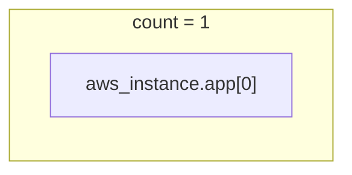
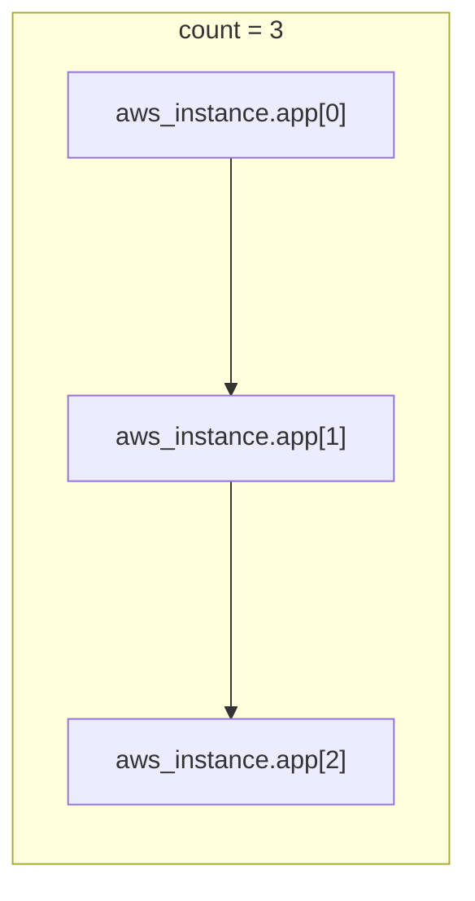
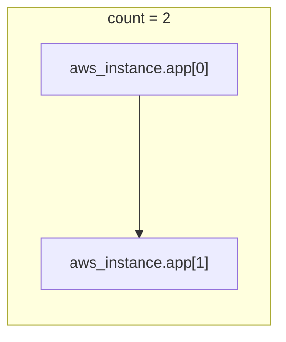
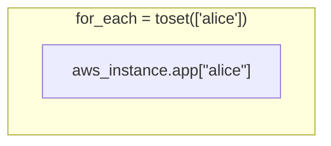
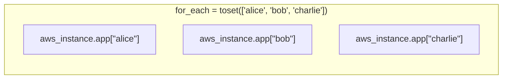
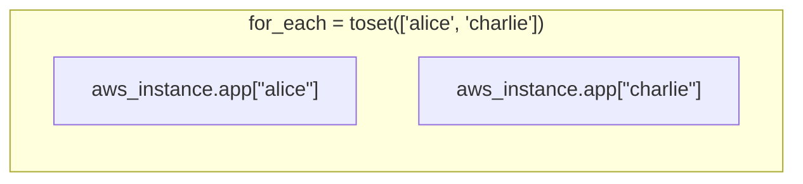

# Advanced Terraform Configuration

In this section, you will learn how to do the following:

- Use Terraform functions to manipulate your configuration.
- Use Terraform expressions to transform data within your configuration.
- Scale infrastructure using `count`.
- Scale infrastructure using `for_each`.
- Dynamically create resource block attributes.
- Define custom conditions for input variable and resource validation.
- Use `terraform console` to iterate on your expressions and interpolations.
- Describe what override files are and how to use them.

## Functions

Terraform provides a number of built-in functions to manipulate your
configuration.

Terraform groups its functions into the following categories:

- Numeric (e.g. `min`, `max`)
- String (e.g. `format`, `join`, `split`)
- Collection (e.g. `contains`, `length`, `sort`)
- Encoding (e.g. `base64encode`, `jsondecode`, `jsonencode`)
- Filesytem (e.g. `file`, `templatefile`)
- Date and Time (e.g. `formatdate`, `timestamp`)
- IP Network (e.g. `cidrhost`, `cidrsubnet`)
- Type Conversion (e.g. `tostring`, `try`)

Let's create a small configuration using a function.

```
output "now" {
  value = timestamp()
}
```

Applying this configuration again and again outputs the updated return value
from the `timestamp()` function.

```
Changes to Outputs:
  + now = (known after apply)

...

Apply complete! Resources: 0 added, 0 changed, 0 destroyed.

Outputs:

now = "2023-04-20T03:37:54Z"
```

```
> terraform apply

Changes to Outputs:
  ~ now = "2023-04-20T03:37:54Z" -> (known after apply)

...

Apply complete! Resources: 0 added, 0 changed, 0 destroyed.

Outputs:

now = "2023-04-20T03:44:05Z"
```

Let's update our configuration to use a different function.

```diff
--- main.tf	2023-04-19 23:54:22.351342416 -0400
+++ main.tf	2023-04-19 23:54:01.445146985 -0400
@@ -1,3 +1,17 @@
+variable "regions" {
+  type = list(string)
+  default = [
+    "us-east-1",
+    "us-east-2",
+    "us-west-1",
+    "us-west-2",
+  ]
+}
+
+output "regions" {
+  value = join(",", var.regions)
+}
+
 output "now" {
   value = timestamp()
 }
```

Applying this shows the updated outputs.

```
Apply complete! Resources: 0 added, 0 changed, 0 destroyed.

Outputs:

now = "2023-04-20T03:55:14Z"
regions = "us-east-1,us-east-2,us-west-1,us-west-2"
```

We can use functions to encode HCL configuration to JSON or YAML.

```diff
--- main.tf	2023-04-20 00:01:19.107239723 -0400
+++ main.tf	2023-04-20 00:00:36.491841123 -0400
@@ -1,3 +1,19 @@
+variable "users" {
+  type = map(any)
+  default = {
+    sudomateo = {
+      name    = "Matthew Sanabria"
+      age     = 30
+      twitter = "https://twitter.com/sudomateo"
+    }
+    foo = {
+      name    = "Foo"
+      age     = 99
+      twitter = "https://twitter.com/foo"
+    }
+  }
+}
+
 variable "regions" {
   type = list(string)
   default = [
@@ -8,6 +24,14 @@
   ]
 }
 
+output "users_to_json" {
+  value = jsonencode(var.users)
+}
+
+output "users_to_yaml" {
+  value = yamlencode(var.users)
+}
+
 output "regions" {
   value = join(",", var.regions)
 }
```

Applying this shows the updated outputs.

```
Apply complete! Resources: 0 added, 0 changed, 0 destroyed.

Outputs:

now = "2023-04-20T04:00:37Z"
regions = "us-east-1,us-east-2,us-west-1,us-west-2"
users_to_json = "{\"foo\":{\"age\":99,\"name\":\"Foo\",\"twitter\":\"https://twitter.com/foo\"},\"sudomateo\":{\"age\":30,\"name\":\"Matthew Sanabria\",\"twitter\":\"https://twitter.com/sudomateo\"}}"
users_to_yaml = <<EOT
"foo":
  "age": 99
  "name": "Foo"
  "twitter": "https://twitter.com/foo"
"sudomateo":
  "age": 30
  "name": "Matthew Sanabria"
  "twitter": "https://twitter.com/sudomateo"

EOT
```

We can also use functions to decode JSON or YAML into HCL.

`users.json`

```json
{
  "foo": {
    "age": 99,
    "name": "Foo",
    "twitter": "https://twitter.com/foo"
  },
  "sudomateo": {
    "age": 30,
    "name": "Matthew Sanabria",
    "twitter": "https://twitter.com/sudomateo"
  }
}
```

`users.yaml`

```yaml
---
foo:                                                                           
  age: 99                                                                      
  name: "Foo"                                                                  
  twitter: "https://twitter.com/foo"                                           
sudomateo:                                                                     
  age: 30                                                                      
  name: "Matthew Sanabria"                                                     
  twitter: "https://twitter.com/sudomateo"
```

Update your configuration.

```
--- main.tf	2023-04-20 00:09:06.499611455 -0400
+++ main.tf	2023-04-20 00:08:08.391067946 -0400
@@ -28,10 +28,18 @@
   value = jsonencode(var.users)
 }
 
+output "users_from_json" {
+  value = jsondecode(file("${path.module}/users.json"))
+}
+
 output "users_to_yaml" {
   value = yamlencode(var.users)
 }
 
+output "users_from_yaml" {
+  value = yamldecode(file("${path.module}/users.yaml"))
+}
+
 output "regions" {
   value = join(",", var.regions)
 }
```

Applying this shows the updated outputs.

```
Apply complete! Resources: 0 added, 0 changed, 0 destroyed.

Outputs:

now = "2023-04-20T04:08:40Z"
regions = "us-east-1,us-east-2,us-west-1,us-west-2"
users_from_json = {
  "foo" = {
    "age" = 99
    "name" = "Foo"
    "twitter" = "https://twitter.com/foo"
  }
  "sudomateo" = {
    "age" = 30
    "name" = "Matthew Sanabria"
    "twitter" = "https://twitter.com/sudomateo"
  }
}
users_from_yaml = {
  "foo" = {
    "age" = 99
    "name" = "Foo"
    "twitter" = "https://twitter.com/foo"
  }
  "sudomateo" = {
    "age" = 30
    "name" = "Matthew Sanabria"
    "twitter" = "https://twitter.com/sudomateo"
  }
}
users_to_json = "{\"foo\":{\"age\":99,\"name\":\"Foo\",\"twitter\":\"https://twitter.com/foo\"},\"sudomateo\":{\"age\":30,\"name\":\"Matthew Sanabria\",\"twitter\":\"https://twitter.com/sudomateo\"}}"
users_to_yaml = <<EOT
"foo":
  "age": 99
  "name": "Foo"
  "twitter": "https://twitter.com/foo"
"sudomateo":
  "age": 30
  "name": "Matthew Sanabria"
  "twitter": "https://twitter.com/sudomateo"

EOT
```

One of the most powerful functions is `templatefile`. With it you can render
templates using data in your Terraform configuration.

`config.tmpl`

```
Now: ${now}

Regions:
%{ for _, region in regions ~}
- ${region}
%{ endfor ~}

Users:
%{ for username, info in users ~}
${username}
%{ for key, val in info ~}
  ${key} - ${val}
%{ endfor ~}
%{ endfor ~}

Users (JSON):
%{ for username, info in users_from_json ~}
${username}
%{ for key, val in info ~}
  ${key} - ${val}
%{ endfor ~}
%{ endfor ~}

Users (YAML):
%{ for username, info in users_from_yaml ~}
${username}
%{ for key, val in info ~}
  ${key} - ${val}
%{ endfor ~}
%{ endfor ~}
```

Update your configuration to render the above template.

```diff
--- main.tf	2023-04-20 00:45:36.586100402 -0400
+++ main.tf	2023-04-20 00:44:50.496669088 -0400
@@ -24,6 +24,18 @@
   ]
 }
 
+output "configuration" {
+  value = templatefile("${path.module}/config.tmpl",
+    {
+      now             = timestamp(),
+      regions         = var.regions,
+      users           = var.users,
+      users_from_json = jsondecode(file("${path.module}/users.json")),
+      users_from_yaml = yamldecode(file("${path.module}/users.yaml")),
+    }
+  )
+}
+
 output "users_to_json" {
   value = jsonencode(var.users)
 }
```

Applying this shows the updated outputs.

```
Apply complete! Resources: 0 added, 0 changed, 0 destroyed.

Outputs:

configuration = <<EOT
Now: 2023-04-20T04:44:58Z

Regions:
- us-east-1
- us-east-2
- us-west-1
- us-west-2

Users:
foo
  age - 99
  name - Foo
  twitter - https://twitter.com/foo
sudomateo
  age - 30
  name - Matthew Sanabria
  twitter - https://twitter.com/sudomateo

Users (JSON):
foo
  age - 99
  name - Foo
  twitter - https://twitter.com/foo
sudomateo
  age - 30
  name - Matthew Sanabria
  twitter - https://twitter.com/sudomateo

Users (YAML):
foo
  age - 99
  name - Foo
  twitter - https://twitter.com/foo
sudomateo
  age - 30
  name - Matthew Sanabria
  twitter - https://twitter.com/sudomateo

EOT
now = "2023-04-20T04:44:58Z"
regions = "us-east-1,us-east-2,us-west-1,us-west-2"
users_from_json = {
  "foo" = {
    "age" = 99
    "name" = "Foo"
    "twitter" = "https://twitter.com/foo"
  }
  "sudomateo" = {
    "age" = 30
    "name" = "Matthew Sanabria"
    "twitter" = "https://twitter.com/sudomateo"
  }
}
users_from_yaml = {
  "foo" = {
    "age" = 99
    "name" = "Foo"
    "twitter" = "https://twitter.com/foo"
  }
  "sudomateo" = {
    "age" = 30
    "name" = "Matthew Sanabria"
    "twitter" = "https://twitter.com/sudomateo"
  }
}
users_to_json = "{\"foo\":{\"age\":99,\"name\":\"Foo\",\"twitter\":\"https://twitter.com/foo\"},\"sudomateo\":{\"age\":30,\"name\":\"Matthew Sanabria\",\"twitter\":\"https://twitter.com/sudomateo\"}}"
users_to_yaml = <<EOT
"foo":
  "age": 99
  "name": "Foo"
  "twitter": "https://twitter.com/foo"
"sudomateo":
  "age": 30
  "name": "Matthew Sanabria"
  "twitter": "https://twitter.com/sudomateo"

EOT
```

Let's update the module for the todo application to make use of functions where
appropriate.

## Expressions

Terraform uses expressions to reference or compute data in your configuration.

We've already seen many expressions in our configuration.

### Types and Values

Every variable type has a literal syntax that can be used directly in your
configuration.

```hcl
output "literal_string" {
  value = "foo"
}

output "literal_number" {
  value = 30
}

output "literal_bool" {
  value = true
}

output "literal_list" {
  value = [
    "us-east-1",
    "us-east-2",
    "us-west-1",
    "us-west-2",
  ]
}

output "literal_map" {
  value = {
    sudomateo = {
      name    = "Matthew Sanabria"
      age     = 30
      twitter = "https://twitter.com/sudomateo"
    }
    foo = {
      name    = "Foo"
      age     = 99
      twitter = "https://twitter.com/foo"
    }
  }
}
```

Literals are often used as defaults for complex variables.

```hcl
variable "users" {
  type = map(any)
  default = {
    sudomateo = {
      name    = "Matthew Sanabria"
      age     = "test"
      twitter = "https://twitter.com/sudomateo"
    }
    foo = {
      name    = "Foo"
      age     = 99
      twitter = "https://twitter.com/foo"
    }
  }
}

variable "regions" {
  type = list(string)
  default = [
    "us-east-1",
    "us-east-2",
    "us-west-1",
    "us-west-2",
  ]
}
```

There's one special type, `null`, that represents the absence of a value. When
an attribute is set to `null`, it's as if it does not exist in the configuration
at all.

```hcl
terraform {
  required_providers {
    aws = {
      source  = "hashicorp/aws"
      version = "~> 4.0"
    }
  }
}

provider "aws" {}

data "aws_ami" "ubuntu" {
  most_recent = true

  filter {
    name   = "name"
    values = ["ubuntu/images/hvm-ssd/ubuntu-jammy-22.04-amd64-server-*"]
  }

  filter {
    name   = "virtualization-type"
    values = ["hvm"]
  }

  owners = ["099720109477"] # Canonical's AWS account ID.
}

resource "aws_instance" "app" {
  ami           = data.aws_ami.ubuntu.id
  instance_type = "t3.micro"
  key_name      = null
}
```

### Strings and Templates

Strings can use escape sequences to provide special behavior.

```hcl
output "literal_string" {
  value = "foo"
}

output "literal_string_with_escapes" {
  value = "foo\nbar\nbaz"
}
```

Heredoc strings are also supported to make working with multi-line strings
easier.

```hcl
output "heredoc_string" {
  value = <<EOF
foo
  - foo
bar
  - bar
baz
  - baz
EOF
}
```

String templates can be used to render simple templates.

```hcl
locals {
  name = "Matthew Sanabria"
}

output "string_template" {
  value = "Hello, I'm ${local.name}!"
}
```

Strings templates support directives to provide templating functionality.

```hcl
locals {
  name = "Matthew Sanabria",
  regions = [
    "us-east-1",
    "us-east-2",
  ]
}

output "greeting" {
  value = "Hello%{if local.name != ""}, I'm ${local.name}%{endif}!"
}

output "regions" {
  value = <<EOT
%{ for region in local.regions }
region ${region}
%{ endfor }
EOT
}
```

### References to Values

We've already seen how to reference resources, data sources, locals, and more
throughout this course. Let's recap!

- Resources are accessed using `TYPE.NAME` where `TYPE` is the resource type and
  `NAME` is the resource name. For example, `aws_instance.foo`.
- Data sources are accessed using `data.TYPE.NAME` where `TYPE` is the data
  source type and `NAME` is the data source name. For example,
  `data.aws_ami.foo`.
- Input variables are accessed using `var.NAME` where `NAME` is the variable
  name in the configuration. For example, `var.foo`.
- Locals are accessed using `local.NAME` where `NAME` is the local name in the
  configuration. For example, `local.foo`.
- Child module outpus are accessed using `module.NAME.OUTPUT` where `NAME` is
  the name of the child module in the configuration and `OUTPUT` is the output
  name from the child module. For example, `module.foo.app_url`.

In addition to these references, there are global references that you can use.

- `path.module` - Filesystem path of the module where the expression is located.
- `path.root` - Filesystem path of the root module for the configuration.
- `path.cwd` - Filesystem path of the working directory where Terraform was run
  before parsing the `-chdir` option (if used).
- `terraform.workspace` - The name of the currently selected Terraform
  workspace.

### Operators

Terraform supports operators to transform data in your configuration.

```hcl
locals {
  foo = 1
  bar = 2
}

output "arithmetic" {
  value = local.foo + local.bar
}

output "equality" {
  value = local.foo == local.bar
}

output "comparison" {
  value = local.foo >= local.bar
}

output "logical" {
  value = local.foo > 0 && local.bar > 0
}
```

### Conditional Expressions

Terraform supports ternary conditional expressions that can be used to make
decisions based on data. The syntax for a conditional expression is as follows.

```
condition ? true_val : false_val
```

Here we use a ternary conditional expression to only use the `instance_type`
variable when it's not empty.

```hcl
terraform {
  required_providers {
    aws = {
      source  = "hashicorp/aws"
      version = "~> 4.0"
    }
  }
}

provider "aws" {}

variable "instance_type" {
  type    = string
  default = "t3.micro"
}

data "aws_ami" "ubuntu" {
  most_recent = true

  filter {
    name   = "name"
    values = ["ubuntu/images/hvm-ssd/ubuntu-jammy-22.04-amd64-server-*"]
  }

  filter {
    name   = "virtualization-type"
    values = ["hvm"]
  }

  owners = ["099720109477"] # Canonical's AWS account ID.
}

resource "aws_instance" "app" {
  ami           = data.aws_ami.ubuntu.id
  instance_type = var.instance_type != "" ? var.instance_type : "t3.micro"
}
```

When we apply this configuration with a non-empty variable for `instance_type`
the ternary will return `true` and Terraform will use the `instance_type`
variable.

```
> terraform apply -var instance_type="foo"
aws_instance.app: Creating...
╷
│ Error: creating EC2 Instance: InvalidParameterValue: Invalid value 'foo' for InstanceType.
│ 	status code: 400, request id: dc1941b9-72cf-4e0a-8ef1-ee79ff81608f
│ 
│   with aws_instance.app,
│   on main.tf line 33, in resource "aws_instance" "app":
│   33: resource "aws_instance" "app" {
│ 
╵
```

If we pass an empty variable for `instance_type` the ternary will return `false`
and Terraform will use the literal string `t3.micro`.

```
> terraform apply -var instance_type="foo"
aws_instance.app: Creating...
aws_instance.app: Still creating... [10s elapsed]
aws_instance.app: Creation complete after 12s [id=i-040e9e56e010597e5]

Apply complete! Resources: 1 added, 0 changed, 0 destroyed.
```

### For Expressions

Terraform support `for` expressions that can be used to iterate over
collections and transform them.

```hcl
locals {
  users = [
    "sudomateo",
    "foo",
    "bar",
    "baz",
  ]

  users_lowercase = [for user in local.users : lower(user)]

  users_to_map = {
    for user in local.users_lowercase : user => {
      is_admin = user == "sudomateo" ? true : false
    }
  }

  users_admin = {
    for user, attrs in local.users_to_map : user => attrs if lookup(attrs, "is_admin", false) == true
  }

  users_list = [for user in local.users_lowercase : merge({ username = user }, lookup(local.users_to_map, user, {}))]
}

output "users_lowercase" {
  value = local.users_lowercase
}

output "users_to_map" {
  value = local.users_to_map
}

output "users_admin" {
  value = local.users_admin
}

output "users_list" {
  value = local.users_list
}
```

### Splat Expressions

Splat expressions are another way to retrieve values from lists instead of using
a `for` expression.

```hcl
output "users_splat" {
  value = local.users_list[*].username
}
```

## Scaling with `count`

The `count` meta-argument is used to create multiple resources from the same
`resource` block with numbered indices similar to an array.

```hcl
resource "aws_instance" "app" {
  count         = 2
  ami           = data.aws_ami.ubuntu.id 
  instance_type = "t3.micro"

  tags = {
    Name        = "app"
    Environment = "Development"
  }
}
```

Resources using `count` have access to a special `count.index` attribute.

```hcl
resource "aws_instance" "app" {
  count         = 2
  ami           = data.aws_ami.ubuntu.id 
  instance_type = "t3.micro"

  tags = {
    Name        = "app${count.index + 1}"
    Environment = "Development"
  }
}
```

As `count` changes, resources are modified in a Last In First Out (LIFO)
approach.







The `count` argument value can come from a dynamic source like a variable as
long as it's known at plan time.

```hcl
variable "users" {
  type = list(string)
  default = [
    "alice",
    "bob",
    "charlie",
  ]
}

resource "aws_instance" "app" {
  count         = length(var.users)
  ami           = data.aws_ami.ubuntu.id 
  instance_type = "t3.micro"

  tags = {
    Name        = "app-${count.index}"
    Owner       = var.users[count.index]
    Environment = "Development"
  }
}
```

Setting `count` to `0` tells Terraform not to create any of that resource.

```hcl
resource "aws_instance" "app" {
  count         = 0
  ami           = data.aws_ami.ubuntu.id 
  instance_type = "t3.micro"

  tags = {
    Name        = "app${count.index + 1}"
    Environment = "Development"
  }
}
```

This can be used to conditionally create resources.

```hcl
variable "create" {
  type    = bool
  default = false
}

resource "aws_instance" "app" {
  count         = var.create ? 1 : 0
  ami           = data.aws_ami.ubuntu.id 
  instance_type = "t3.micro"

  tags = {
    Name        = "app${count.index + 1}"
    Environment = "Development"
  }
}
```

## Scaling with `for_each`

The `for_each` meta-argument is used to create multiple resources from the same
`resource` block with named keys similar to a set.

```hcl
resource "aws_instance" "app" {
  for_each      = toset(["alice", "bob", "charlie"])
  ami           = data.aws_ami.ubuntu.id 
  instance_type = "t3.micro"

  tags = {
    Name        = "app"
    Environment = "Development"
  }
}
```

Resources using `for_each` have access to special `each.key` and `each.value`
attributes.

```hcl
resource "aws_instance" "app" {
  for_each      = toset(["alice", "bob", "charlie"])
  ami           = data.aws_ami.ubuntu.id 
  instance_type = "t3.micro"

  tags = {
    Name        = "app-${each.key}"
    Environment = "Development"
  }
}
```

As `for_each` changes, resources are modified by their key.







The `for_each` argument value can come from a dynamic source like a variable.

```hcl
variable "users" {
  type = list(string)
  default = [
    "alice",
    "bob",
    "charlie",
  ]
}

resource "aws_instance" "app" {
  for_each      = toset(var.users)
  ami           = data.aws_ami.ubuntu.id 
  instance_type = "t3.micro"

  tags = {
    Name        = "app-${each.key}"
    Environment = "Development"
  }
}
```

## Dynamic Blocks

Resources can have nested block attributes. We've already seen this with the
`ingress` block on the `aws_security_group` resource.

```hcl
resource "aws_security_group" "app" {
  name        = "app"
  description = "Security group for app."

  ingress {
    description      = "SSH"
    from_port        = 22
    to_port          = 22
    protocol         = "tcp"
    cidr_blocks      = ["0.0.0.0/0"]
    ipv6_cidr_blocks = ["::/0"]
  }

  ingress {
    description      = "HTTP"
    from_port        = 80
    to_port          = 80
    protocol         = "tcp"
    cidr_blocks      = ["0.0.0.0/0"]
    ipv6_cidr_blocks = ["::/0"]
  }

  egress {
    from_port        = 0
    to_port          = 0
    protocol         = "-1"
    cidr_blocks      = ["0.0.0.0/0"]
    ipv6_cidr_blocks = ["::/0"]
  }
}
```

When we want to add or remove blocks from a resource, we have to update the code
to add another block.

```diff
--- main.tf	2023-04-20 20:47:44.036245497 -0400
+++ main.tf	2023-04-20 20:48:01.274418005 -0400
@@ -20,6 +20,15 @@
     ipv6_cidr_blocks = ["::/0"]
   }
 
+  ingress {
+    description      = "HTTPS"
+    from_port        = 443
+    to_port          = 443
+    protocol         = "tcp"
+    cidr_blocks      = ["0.0.0.0/0"]
+    ipv6_cidr_blocks = ["::/0"]
+  }
+
   egress {
     from_port        = 0
     to_port          = 0
```

This can be cumbersome to do repeatedly when working on Terraform configuration.

Instead, Terraform supports dynamically creating block attributes on resources.
This is done using the `dynamic` keyword like so.

```hcl
variable "ingress_rules" {
  type = set(object({
    from_port   = number
    to_port     = number
    protocol    = string
    description = optional(string, "")
  }))

  default = [
    {
      from_port   = 22
      to_port     = 22
      protocol    = "tcp"
      description = "SSH"
    },
    {
      from_port   = 80
      to_port     = 80
      protocol    = "tcp"
      description = "HTTP"
    }
  ]
}

resource "aws_security_group" "app" {
  name_prefix = "app"
  description = "Security group for app."

  dynamic "ingress" {
    for_each = var.ingress_rules

    content {
      description      = ingress.value.description
      from_port        = ingress.value.from_port
      to_port          = ingress.value.to_port
      protocol         = ingress.value.protocol
      cidr_blocks      = ["0.0.0.0/0"]
      ipv6_cidr_blocks = ["::/0"]
    }
  }

  egress {
    from_port        = 0
    to_port          = 0
    protocol         = "-1"
    cidr_blocks      = ["0.0.0.0/0"]
    ipv6_cidr_blocks = ["::/0"]
  }
}
```

Now, Terraform will create as many `ingress` block as are needed without needing
to update the configuration.

## Custom Conditions

Terraform supports custom conditions that can be used to validate input
variables and resource attributes.

Use the `validation` block on an input variable to enforce what values it can
hold.

```hcl
variable "image_id" {
  type    = string

  validation {
    condition     = can(regex("^ami-", var.image_id))
    error_message = "The image_id must start with 'ami-'."
  }
}

resource "aws_instance" "app" {
  ami           = var.image_id
  instance_type = "t3.micro"
}
```

Terraform will error when the validation condition is `false`.

```
> terraform apply
var.image_id
  Enter a value: foo

╷
│ Error: Invalid value for variable
│ 
│   on main.tf line 10:
│   10: variable "image_id" {
│     ├────────────────
│     │ var.image_id is "foo"
│ 
│ The image_id must start with 'ami-'.
│ 
│ This was checked by the validation rule at main.tf:13,3-13.
╵
```

This can be used to conditionally use a valid input variable when it's provided
or default to another value when it's not.

```hcl
data "aws_ami" "ubuntu" {
  most_recent = true

  filter {
    name   = "name"
    values = ["ubuntu/images/hvm-ssd/ubuntu-jammy-22.04-amd64-server-*"]
  }

  filter {
    name   = "virtualization-type"
    values = ["hvm"]
  }

  owners = ["099720109477"] # Canonical's AWS account ID.
}

variable "image_id" {
  type    = string
  default = null

  validation {
    condition     = var.image_id == null || can(regex("^ami-", var.image_id))
    error_message = "The image_id must start with 'ami-'."
  }
}

resource "aws_instance" "app" {
  ami           = var.image_id != null ? var.image_id : data.aws_ami.ubuntu.id
  instance_type = "t3.micro"
}
```

Resources also support conditions to enforce their attributes meet a certain
condtion.

Use the `precondition` and `postcondition` blocks to create a precondition and
postcondition respectively.

```hcl
resource "aws_instance" "app" {
  ami           = var.image_id != null ? var.image_id : data.aws_ami.ubuntu.id
  instance_type = "t3.micro"

  lifecycle {
    precondition {
      condition     = data.aws_ami.ubuntu.architecture == "x86_64"
      error_message = "The AMI must be for the x86_64 architecture."
    }

    postcondition {
      condition     = can(regex("t3\\.", self.instance_type))
      error_message = "The instance_type must start with 't3.'."
    }
  }
}
```

Only `postcondition` blocks can access attributes of the resource using `self`.
The condition within a `precondition` block can only use data that's available
during the plan.

## Terraform Console

The feedback loop for testing your expressions can be long. Terraform has a
built-in console that can be used to evaluate expressions and interpolations.

Use `terraform console` to start the console. Terraorm will read your
configuration, your state, and any input variables and give you access to them
in the console.

```
> terraform console
> var.ingress_rules
tolist([
  {
    "description" = "SSH"
    "from_port" = 22
    "protocol" = "tcp"
    "to_port" = 22
  },
  {
    "description" = "HTTP"
    "from_port" = 80
    "protocol" = "tcp"
    "to_port" = 80
  },
])

> [ for rule in var.ingress_rules: rule if rule.description == "HTTP"]
[
  {
    "description" = "HTTP"
    "from_port" = 80
    "protocol" = "tcp"
    "to_port" = 80
  },
]

> aws_instance.app.id
"i-01e7f402e03cf9097"
```

## Override Files

While not common, sometimes it's useful to override attributes of specific
resources. Terraform supports `*_override.tf` and `*_override.tf.json` files to
override attributes for resources.

Given a `main.tf` with the following content:

```hcl
resource "aws_instance" "app" {
  ami           = data.aws_ami.ubuntu.id
  instance_type = "t3.micro"
}
```

And a `foo_overrride.tf` file with the following content:

```hcl
resource "aws_instance" "app" {
  instance_type = "t3.small"
}
```

The resulting `aws_instance.app` resource will look like this:

```hcl
resource "aws_instance" "app" {
  ami           = data.aws_ami.ubuntu.id
  instance_type = "t3.small"
}
```
