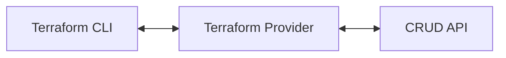
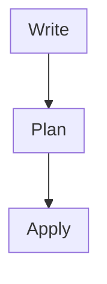

# Terraform Training

## What is Terraform?

Terraform is a tool that lets you define resources as code and perform create,
read, update, and delete (CRUD) operations against those resources. Put another
way, Terraform is a stateful, declarative wrapper around CRUD APIs.

Terraform is often referred to as an "infrastructure as code" tool. While that
is true, Terraform is not limited to managing just infrastructure. It can
manage any resource that is fronted by a CRUD API, including AWS, Azure, GCP
resources, Kubernetes deployments, GitHub repositories, etc.

## Why Terraform?

If you've ever manually created resources by clicking around in a user
interface, you'll know that the process is time consuming and error prone.
Terraform addresses that with the following benefits.

### Declarative Infrastructure

Terraform configuration is declarative. You describe the end state of your
infrastructure and Terraform works to make that a reality. You no longer need
to write complex step-by-step operations to ensure your infrastructure is
correctly provisioned. Terraform builds a resource graph to determine resource
dependencies and creates or modifies non-dependent resources in parallel,
saving you time.

### Idempotent Operations

Terraform will only modify infrastructure that needs modifications. When
Terraform detects that a resource has changed from what you have declared, it
will perform the necessary operations to get the infrastructure back to how it
should be.

### Reusable Configuration

Terraform configuration is stored as files that can be committed to your
version control system (VCS). This allows you to write configuration that can
be consumed across teams, ensuring that each team is deploying consistent
infrastructure in line with your organization's policies.

### Trackable Changes

Terraform generates a plan of what operations it wants to perform before
modifying your infrastructure. Once a plan is approved and applied, Terraform
keeps track of the infrastructure it manages in a state file. Combined with
version control, you'll never wonder who or what created infrastructure again.

## How Does Terraform Work?

Terraform communicates with upstream CRUD APIs using a special type of plugin
known as a provider. Providers allow Terraform to create, read, update, or
delete infrastructure.

There are many providers written for Terraform. You can find providers relevant
to you on the [Terraform Registry](https://registry.terraform.io/).

